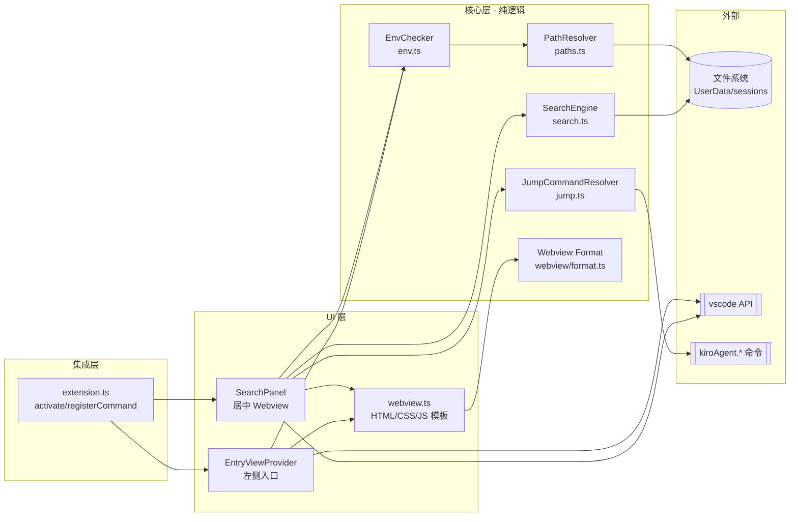
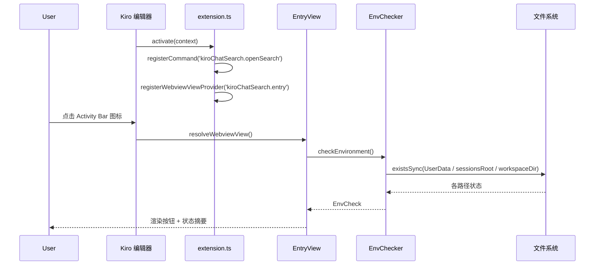
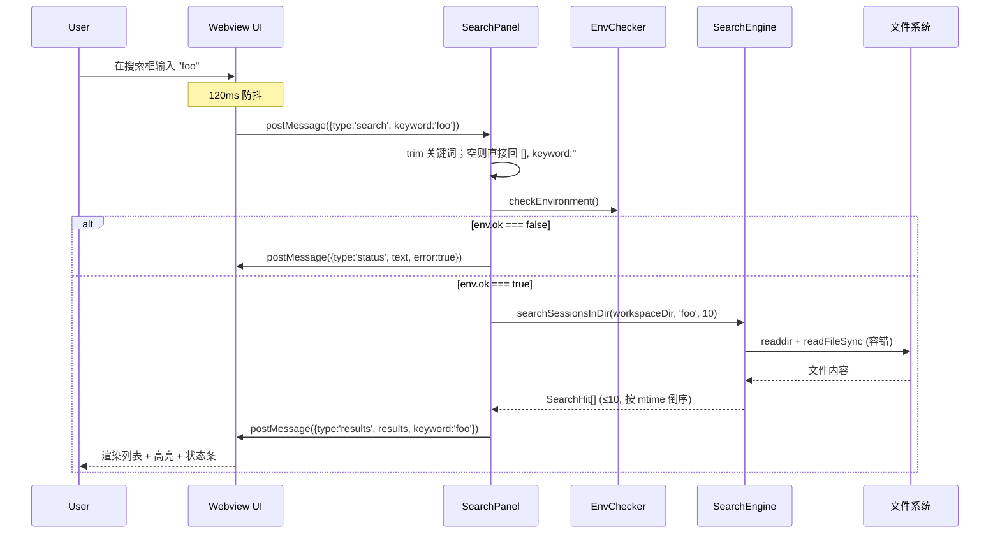
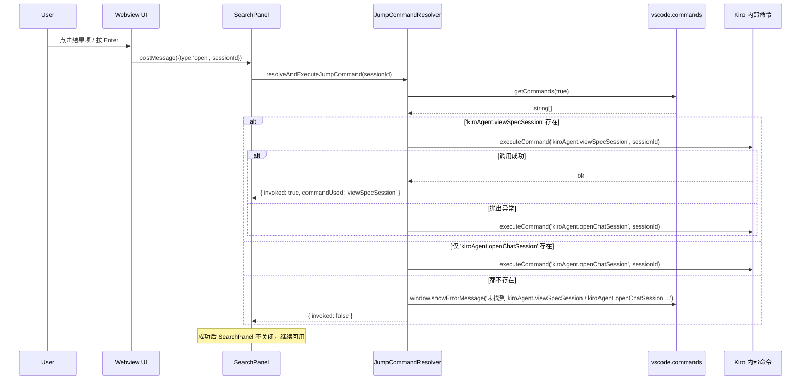
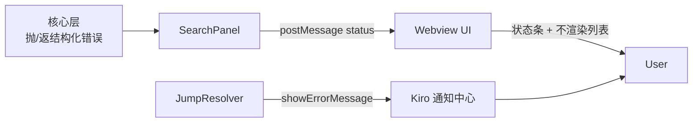

# Design Document

## Overview

Kiro Chat Search 是一个 VSCode/Kiro 扩展，目标是在**当前工作区**范围内对 Kiro 对话历史按关键词进行全文搜索，并通过 Kiro 内部命令（`kiroAgent.viewSpecSession` / `kiroAgent.openChatSession`）跳转到对应会话。整体上是一个纯本地、离线、零网络依赖的工具。

本设计基于已有脚手架（`src/extension.ts`、`src/paths.ts`、`src/search.ts`、`src/webview.ts`）进行细化与重构，重点解决三件事：

1. **职责清晰化**：把目前散落在 `extension.ts` 中的"环境校验"和"跳转命令调用"逻辑拆出独立模块（`EnvChecker`、`JumpCommandResolver`），降低主入口耦合，便于单元测试。
2. **可测试性**：所有跨平台 / 文件系统 / 环境变量相关的逻辑通过 `deps` 参数注入，引入 vitest 与 `tests/` 目录；将 Webview 内联脚本中的纯函数（`escapeHtml` / `highlight` / `fmtTime` / `escapeRegExp`）抽到 `src/webview/format.ts`，使其既能在运行时被注入到 HTML，也能在 vitest 中直接调用。
3. **文档与体验**：按 Requirement 11 完善 README（路径规则、错误排查、开发与打包），并保证 Webview 的 CSP / nonce / HTML 转义在所有用户输入路径都生效。

设计目标（非功能性）：

- **零外部运行时依赖**：仅使用 Node 标准库 + `vscode` API，避免引入网络/数据库依赖；测试期才引入 `vitest` 与 `fast-check`。
- **容错优先**：单个会话文件损坏不应影响整体搜索；环境异常应给出明确中文提示。
- **跨平台一致**：Windows/macOS/Linux 上路径解析、盘符大小写、斜杠方向差异都被显式处理。
- **安全**：Webview 严格遵循 CSP（`default-src 'none'` + `nonce`）、所有渲染到 HTML 的字符串必须转义、用户关键词在用作正则前必须 `escapeRegExp`。

## Architecture

### 模块划分（重构后）

整体分为三层：

- **核心层（pure / 可测）**：`PathResolver`、`SearchEngine`、`EnvChecker`、`JumpCommandResolver`、`webview/format` 工具函数。除 `EnvChecker` 与 `JumpCommandResolver` 通过 `deps` 间接调用 `vscode` API 外，其余为纯 Node。
- **集成层**：`extension.ts`（`activate` / `deactivate`），负责命令注册、视图注册、生命周期。
- **UI 层**：`SearchPanel`（居中 Webview 面板）、`EntryView`（Activity Bar 视图）、`webview.ts`（HTML/CSS/JS 模板，注入 `format` 工具）。



### 与现有代码的差异（重构点）

| 当前位置 | 重构目标 | 原因 |
| --- | --- | --- |
| `extension.ts::checkEnvironment` 函数 | 抽出到 `src/env.ts`，导出 `checkEnvironment(deps?)` | 解除对 `vscode.workspace` 的硬编码，使其可在 vitest 中通过 `deps` 注入 mock workspace |
| `extension.ts::SearchPanel.openSession` 内部命令查找 | 抽出到 `src/jump.ts`，导出 `resolveAndExecuteJumpCommand(sessionId, deps?)` | 同上，便于在测试中 mock `vscode.commands.getCommands` / `executeCommand` |
| `paths.ts` 直接调用 `process.platform` / `process.env` | 增加可选参数对象（`platform`、`env`、`homedir`、`existsSync`、`statSync`），保留原签名作为默认 | 不破坏现有调用方，同时让单元测试无需污染全局 |
| Webview 内联脚本中的 `escapeHtml` / `highlight` / `fmtTime` | 抽到 `src/webview/format.ts`，由 `webview.ts` 通过 `toString()` + 模板字符串注入到 HTML | 让纯函数可在 vitest 中直接 import 测试，避免 jsdom 复杂度 |
| 无 `tests/` 目录 | 新增 `tests/` 与 `vitest.config.ts`，添加 `npm test` 脚本 | 满足 Requirement 10 |
| README 内容不完整 | 按 Requirement 11 重写 | 满足文档完善 |

### 进程边界与运行时

- **扩展宿主进程（Node）**：`PathResolver`、`SearchEngine`、`EnvChecker`、`JumpCommandResolver`、`extension.ts`、`SearchPanel`/`EntryView` 的控制逻辑都运行在这里，可访问文件系统与 `vscode` API。
- **Webview 渲染进程（Chromium，沙箱）**：`webview.ts` 输出的 HTML/CSS/JS 在此运行，仅能通过 `postMessage` 与扩展宿主通信，不直接访问 fs。
- **跳转目标命令（Kiro 内部）**：通过 `vscode.commands.executeCommand` 跨边界调用，由 Kiro 自身处理实际跳转。

## Components and Interfaces

### PathResolver（`src/paths.ts`）

负责跨平台路径解析与工作区编码。**保留现有函数签名以兼容**，新增可选 `deps` 参数以便测试注入。

```ts
export interface PathResolverDeps {
  platform?: NodeJS.Platform;          // 默认 process.platform
  env?: NodeJS.ProcessEnv;             // 默认 process.env
  homedir?: () => string;              // 默认 os.homedir
  existsSync?: (p: string) => boolean; // 默认 fs.existsSync
  statSync?: (p: string) => { isDirectory(): boolean }; // 默认 fs.statSync
}

export function getKiroUserDataDir(deps?: PathResolverDeps): string | null;
export function getSessionsRoot(deps?: PathResolverDeps): { root: string | null; userDataDir: string | null };
export function encodeWorkspaceKeys(workspacePath: string): string[];
export function resolveWorkspaceSessionDir(
  sessionsRoot: string,
  workspacePath: string,
  deps?: PathResolverDeps,
): string | null;
```

职责对应需求：

- `getKiroUserDataDir` → Requirement 1.1 / 1.2 / 1.3 / 1.4
- `getSessionsRoot` → Requirement 1.5 / 1.6
- `encodeWorkspaceKeys` → Requirement 2.1 / 2.2 / 2.3 / 2.4
- `resolveWorkspaceSessionDir` → Requirement 2.5 / 2.6

关键实现要点：

- Windows 候选路径：优先 `env.APPDATA`，缺失则 `path.join(homedir, 'AppData', 'Roaming')`，再拼 `Kiro`。
- macOS 候选路径：`<homedir>/Library/Application Support/Kiro`。
- Linux 候选路径：优先 `env.XDG_CONFIG_HOME`，缺失则 `<homedir>/.config`，再拼 `Kiro`。
- `encodeWorkspaceKeys` 使用 `Set` 去重，先生成路径变体（盘符大小写 × 斜杠方向），再统一做 base64url 变换：`base64 → 去掉 = → + → - → / → _`。

### EnvChecker（新模块 `src/env.ts`）

把当前在 `extension.ts` 中的 `checkEnvironment` 与 `EnvCheck` 类型迁移到独立模块，便于单测。

```ts
export interface EnvCheck {
  ok: boolean;
  error?: string;
  hint?: string;
  userDataDir?: string;
  sessionsRoot?: string;
  workspaceDir?: string;
}

export interface EnvCheckerDeps {
  platform?: NodeJS.Platform;
  workspaceFolder?: { uri: { fsPath: string } } | null;
  pathResolver?: PathResolverDeps;
}

export function checkEnvironment(deps?: EnvCheckerDeps): EnvCheck;
```

职责：聚合 `PathResolver` 的输出与当前工作区状态，按 Requirement 7.5 定义的优先级返回**第一个**错误：

1. UserDataDir 缺失
2. SessionsRoot 缺失
3. 未打开工作区
4. WorkspaceSessionDir 缺失

每种错误场景都返回 `{ ok: false, error, hint, ...partialPaths }`，已知的部分路径（如 `userDataDir`）应被包含到结果中以便 UI 展示与排错。

### SearchEngine（`src/search.ts`）

在保留现有 `searchSessionsInDir` / `listRecentSessions` 对外行为的基础上，引入 `SessionIndexCache` 与附件标记。

```ts
export interface SearchHit {
  sessionId: string;
  title: string;
  modified: number;
  snippet: string;
  matchField: 'title' | 'message' | 'recent';
  hasImage: boolean;        // 会话是否含内嵌图片
  hasAttachment: boolean;   // 会话是否含非空 contextItems 附件
}

/** 进程内会话索引缓存条目（不含原始 JSON，仅保留匹配所需的精简数据） */
interface SessionIndexEntry {
  sessionId: string;
  mtimeMs: number;
  title: string;
  text: string;             // 已剔除 base64 图片的可匹配纯文本
  firstUserText: string;    // 最近列表的预览来源
  hasImage: boolean;
  hasAttachment: boolean;
}

export function searchSessionsInDir(
  dir: string,
  keyword: string,
  limit?: number, // 默认 10
): SearchHit[];

export function listRecentSessions(
  dir: string,
  limit?: number, // 默认 20
): SearchHit[];
```

职责对应需求：Requirement 4.\*、Requirement 5.\*、Requirement 12.1–12.4、Requirement 13.\*。

关键实现要点：

- **缓存读取统一入口**：新增内部函数 `loadIndex(dir)`，负责 `readdir` 目录、对每个 `.json` 文件按 `mtimeMs` 比对缓存：命中且 mtime 未变 → 复用缓存条目（不 `readFileSync` / 不 `JSON.parse`）；未命中或 mtime 变化 → 解析文件、构建 `SessionIndexEntry` 并写回缓存。`loadIndex` 还负责清理"缓存中存在但目录下已消失"的条目。
- **解析时即提取**：解析一个文件时一次性算出 `title`、可匹配 `text`、`firstUserText`、`hasImage`、`hasAttachment`，存入缓存条目。`searchSessionsInDir` 与 `listRecentSessions` 都基于 `loadIndex` 的输出，不再各自重复解析。
- **base64 剔除**：构建 `text` 时跳过 `imageUrl` / `image` / `data:` URL 这类内嵌二进制，避免把上万字符的 base64 纳入匹配文本与内存（Requirement 13.5）。
- **图片检测短路**：扫描消息 content 时一旦遇到 `type` 含 `image` 或带 `imageUrl` 字段即置 `hasImage=true` 并停止图片扫描，不读取 base64 内容（Requirement 12.3）。
- **附件检测**：任一消息项 `contextItems` 为非空数组即 `hasAttachment=true`（Requirement 12.2）。
- 关键词匹配、标题优先、snippet 截取、`mtimeMs` 倒序、`limit` 截断、单文件容错等既有行为保持不变。
- **缓存为进程内内存缓存**（模块级 `Map`），不持久化；扩展停用随进程释放（Requirement 13.6）。缓存只影响性能、不改变相同输入的可观察结果（Requirement 13.7）。

- **AttachmentFilter（全部 / 仅含图片 / 仅含附件）由 Webview 前端在 `SearchHit[]` 上做内存过滤**。切换过滤 tab 时，前端先在已有数据上即时过滤渲染，同时发 `revalidate` 请求 Host 按当前关键词重新取数；Host 重读经过 `(mtime, size)` 缓存，仅重解析变化的文件，再把最新结果推回前端二次渲染。这样过滤始终作用于最新会话数据（含面板打开后新增的对话），同时避免无谓的全量重解析。SearchEngine 只负责把 `hasImage` / `hasAttachment` 算准并随结果返回。

### JumpCommandResolver（新模块 `src/jump.ts`）

把命令解析与执行从 `SearchPanel.openSession` 中剥离：

```ts
export interface JumpDeps {
  getCommands?: (filterInternal?: boolean) => Promise<string[]>;
  executeCommand?: <T = unknown>(cmd: string, ...args: unknown[]) => Promise<T>;
  showError?: (msg: string) => void;
  candidates?: string[]; // 默认 ['kiroAgent.viewSpecSession', 'kiroAgent.openChatSession']
}

export interface JumpResult {
  invoked: boolean;
  commandUsed?: string;
  error?: unknown;
}

export async function resolveAndExecuteJumpCommand(
  sessionId: string,
  deps?: JumpDeps,
): Promise<JumpResult>;
```

职责对应需求：Requirement 9.\*、Requirement 7.8。

行为：

1. 校验 `sessionId` 非空，否则返回 `{ invoked: false }`。
2. 通过 `getCommands(true)` 获取当前可用命令列表。
3. 按 `candidates` 顺序查找：第一个存在的命令优先调用；若调用抛错则继续尝试下一个。
4. 全部失败 → 调用 `showError`，错误文案 SHALL 同时列出两个候选命令名（`kiroAgent.viewSpecSession`、`kiroAgent.openChatSession`），并提示"请确认插件运行在 Kiro 中"。

### Webview Format Helpers（新模块 `src/webview/format.ts`）

把目前内嵌在 `webview.ts` 模板字符串里的纯函数抽出，使其同时可被 vitest 单测：

```ts
export function escapeHtml(s: string): string;
export function escapeRegExp(s: string): string;
export function highlight(text: string, keyword: string): string;
export function fmtTime(ms: number, now?: Date): string;
```

`webview.ts` 在生成 HTML 时通过 `helper.toString()` + 模板字符串拼接，把这些函数原样注入到 `<script nonce="...">` 中，确保运行时与单测使用**完全相同**的实现。

约束：

- `highlight` 必须先 `escapeHtml(text)`，再用 `escapeRegExp(keyword)` + `gi` 标志构造正则，最后将匹配子串包裹为 `<mark>...</mark>`。
- `fmtTime` 接受可选的 `now` 参数（默认 `new Date()`），便于测试断言"今天 / 当年 / 跨年"三种格式。

### EntryView（`extension.ts` 中 `EntryViewProvider`）

左侧 Activity Bar 入口视图，职责：

- 渲染一个"🔍 打开搜索"按钮，点击后通过 `postMessage({ type: 'open' })` 请求扩展宿主执行 `kiroChatSearch.openSearch` 命令。
- 渲染当前 `EnvCheck` 的摘要：成功显示 `userDataDir` 与 `workspaceDir`；失败显示 `error` 与 `hint`。
- 所有动态内容必须经过 `escapeHtml` 防 XSS（路径中可能含特殊字符）。

注意：因为 EntryView 是普通 `WebviewView`（非 panel），无法保留昂贵状态，每次 `resolveWebviewView` 都会重新 `checkEnvironment()`，符合需求且无性能问题。

### SearchPanel（`extension.ts` 中 `SearchPanel` 类）

居中的 `WebviewPanel`，承载搜索框与结果列表。职责：

- 单例：用 `static current` 持有当前实例；`showOrCreate` 时若已存在则 `reveal` 并 `postMessage({ type: 'focus' })`。
- 创建参数：viewType=`kiroChatSearch.panel`、title=`Kiro 对话搜索`、`ViewColumn.Active`、`enableScripts`、`retainContextWhenHidden`、`localResourceRoots = [extensionUri/media]`。
- 与 Webview 的消息协议（见 Data Models 节）。
- HTML 通过 `getWebviewHtml(webview, nonce)` 注入，nonce 在每次创建时生成（32 字符随机串）。

### Webview UI（`src/webview.ts`）

负责生成 Webview HTML，安全要点：

- CSP：`default-src 'none'; style-src ${webview.cspSource} 'unsafe-inline'; script-src 'nonce-${nonce}'; font-src ${webview.cspSource}; img-src ${webview.cspSource} data:`。
- 内联 `<script>` 必须带 `nonce`。
- 调用 `webview/format` 中的 `escapeHtml` / `highlight` 处理所有渲染到 DOM 的字符串（标题、snippet、关键词）。
- 输入防抖：搜索框 `input` 事件 setTimeout 120ms。
- 键盘交互：`ArrowUp` / `ArrowDown` 循环、`Enter` 打开、`Esc` 关闭。
- 时间格式：今天 `今天 HH:mm`；同年 `MM-DD HH:mm`；跨年 `YYYY-MM-DD HH:mm`。

## Data Models

### EnvCheck

来自 `EnvChecker.checkEnvironment`，是 EntryView 与 SearchPanel 共用的环境状态结构。

```ts
interface EnvCheck {
  ok: boolean;            // 是否一切就绪
  error?: string;         // 错误标题（中文）
  hint?: string;          // 排查指引（中文）
  userDataDir?: string;   // 已识别的 Kiro 用户数据目录
  sessionsRoot?: string;  // 已识别的 sessions 根目录
  workspaceDir?: string;  // 当前工作区对应的会话子目录
}
```

约束：

- `ok === true` 时 `userDataDir`、`sessionsRoot`、`workspaceDir` 均存在；`error` / `hint` 可省略。
- `ok === false` 时 `error` 必填；已识别的部分路径应尽量保留以便排错。

### SearchHit

```ts
interface SearchHit {
  sessionId: string;                  // 文件名去掉 .json 后的部分
  title: string;                      // 优先 obj.title，其次 obj.name；都没有则 'Untitled'
  modified: number;                   // 文件 mtimeMs，用于排序与展示
  snippet: string;                    // title 命中 → 即标题；message 命中 → 上下文片段；recent → 首条用户消息预览
  matchField: 'title' | 'message' | 'recent';  // 命中字段；recent 表示无关键词的最近列表项
  hasImage: boolean;                  // 会话是否含内嵌图片（content[].type~image 或 imageUrl）
  hasAttachment: boolean;             // 会话是否含非空 contextItems 附件
}
```

### SessionIndexEntry（缓存条目）

```ts
interface SessionIndexEntry {
  sessionId: string;
  mtimeMs: number;        // 失效依据之一：与磁盘 mtime 比对
  size: number;           // 失效依据之二：与磁盘文件字节大小比对
  title: string;
  text: string;           // 用于关键词匹配的纯文本，已剔除 base64 图片数据
  firstUserText: string;  // 最近列表的预览来源
  hasImage: boolean;
  hasAttachment: boolean;
}
```

约束：

- 缓存键为 SessionFile 绝对路径，值为 `SessionIndexEntry`；模块级 `Map`，进程内存活。
- 失效判据为 `(mtimeMs, size)` 二元组：任一变化即重新解析。仅用 mtime 存在"同毫秒内二次写入不被察觉"的理论缝隙，叠加 size 后，内容增长（size 必变）能稳定触发刷新。
- 同一 `(dir, keyword, limit)` 输入在缓存命中与未命中时返回的 `SearchHit[]` 必须完全一致（缓存不改变可观察结果）。

### SessionFile（输入数据，TS 描述兼容形态）

兼容下列形态（均为 JSON 顶层对象）：

```ts
type SessionFile = {
  title?: string;
  name?: string;
  history?: HistoryItem[];
  messages?: MessageItem[];
};

type HistoryItem = { message?: { content?: string | ContentPart[] } } | MessageItem;
type MessageItem = { content?: string | ContentPart[]; text?: string };
type ContentPart = string | { text?: string };
```

实际实现按 duck-typing 处理；任何字段缺失都按 Requirement 5 容错。

### Webview 消息协议

| 方向 | type | payload | 说明 |
| --- | --- | --- | --- |
| Webview → Host | `ready` | — | 面板就绪，请求初始环境状态 |
| Webview → Host | `search` | `{ keyword: string }` | 触发一次搜索（已被 120ms 防抖） |
| Webview → Host | `revalidate` | — | 请求按当前关键词重新取数（切换过滤 tab 时发出，确保过滤作用于最新数据） |
| Webview → Host | `open` | `{ sessionId: string }` | 请求跳转到对应会话 |
| Webview → Host | `close` | — | 用户按 Esc，请求关闭面板 |
| Host → Webview | `status` | `{ text: string; error?: boolean }` | 显示状态 / 错误条 |
| Host → Webview | `results` | `{ results: SearchHit[]; keyword: string }` | 搜索结果或最近列表；每项含 `hasImage` / `hasAttachment` 供 UI 过滤 |
| Host → Webview | `focus` | — | 让搜索框聚焦并选中已有文本 |

约束：

- Host → Webview 的 `results.keyword` 一定是经过 `trim()` 的实际查询字符串，用于前端高亮。
- Webview → Host 的所有字段都视为不可信，Host 必须 `String(...)` 强制转换并自行 `trim` / 校验。
- **AttachmentFilter（全部 / 仅含图片 / 仅含附件）由 Webview 前端在已收到的 `SearchHit[]` 上过滤渲染**。切换过滤 tab 时前端先即时过滤（即时反馈），并发送 `revalidate` 让 Host 按当前关键词重新取数；Host 推回最新 `results` 后前端在新数据上再次应用过滤模式（Requirement 12.7）。切换关键词时 Host 也会重新推送 `results`，前端同样在新结果上应用当前过滤（Requirement 12.8）。面板/视图重新可见时 Host 主动 `refresh` 一次（Requirement 12.10）。

## Key Flows

### 初始化（激活扩展）



### 搜索流程



### 跳转流程




## Correctness Properties

*属性（property）是一种应当在系统所有合法执行路径上都成立的特征或行为——本质上是关于"系统应当做什么"的形式化陈述。属性是连接人类可读规约与机器可验证正确性保证的桥梁。*

下列属性来自对验收标准的逐条 prework 分析与去冗余反思。每条属性都对应一个或多个验收标准，且能被 fast-check 这类属性测试库以"对所有输入 X，性质 P(X) 成立"的形式直接编码。Webview 端的 UI 交互（键盘导航、滚动、防抖）与字符串文案被分类为 EXAMPLE 或 EDGE_CASE，由表驱动单测覆盖，不在此节列出。

### Property 1: 跨平台 UserDataDir 拼接规则

*For any* 输入 `(platform, env, homedir)` 三元组（其中 `platform ∈ { 'win32', 'darwin', 'linux' }`），`getKiroUserDataDir(deps)` 在 `existsSync` 永真的前提下满足：

- `platform === 'win32'` → 返回 `path.join(env.APPDATA ?? path.join(homedir, 'AppData', 'Roaming'), 'Kiro')`
- `platform === 'darwin'` → 返回 `path.join(homedir, 'Library', 'Application Support', 'Kiro')`
- `platform === 'linux'` （默认分支）→ 返回 `path.join(env.XDG_CONFIG_HOME ?? path.join(homedir, '.config'), 'Kiro')`

且当 `existsSync` 永假时，对所有平台输入 `getKiroUserDataDir(deps) === null`。

**Validates: Requirements 1.1, 1.2, 1.3, 1.4**

### Property 2: SessionsRoot 拼接与存在性回退

*For any* 已确定的 `userDataDir` 字符串和任意 `existsSync` mock：

- `existsSync(<userDataDir>/User/globalStorage/kiro.kiroagent/workspace-sessions) === true` → `getSessionsRoot(deps).root` 等于该拼接路径，且 `userDataDir` 字段保留
- `existsSync(...) === false` → `getSessionsRoot(deps).root === null`，但 `userDataDir` 字段仍被保留

**Validates: Requirements 1.5, 1.6**

### Property 3: base64url 编码合法、确定、注入

*For any* 字符串 `s`、`t`（任意 UTF-8 输入），`encodeWorkspaceKeys` 内部使用的 base64url 变换满足：(a) 输出 `encoded` 仅由 `[A-Za-z0-9_-]` 组成（不含 `=`、`+`、`/`）；(b) 确定性——对同一输入多次编码结果相同；(c) 注入性——若 `s !== t` 则 `encode(s) !== encode(t)`。

> 注：Kiro 把 padding `=` 也替换为 `_`，与原文 `/` 替换后的 `_` 共用同一字符，因此从纯字符串形式无法无歧义地反向解码（不存在严格的"可逆性"）。设计上接受这个歧义，因为底层 base64 自身是注入的，编码后路径仍可作为唯一的目录键使用。

**Validates: Requirements 2.1**

### Property 4: 路径变体覆盖（盘符与斜杠维度）

*For any* WorkspacePath `p`（含 Windows 盘符与混合斜杠），`encodeWorkspaceKeys(p)` 的输出列表 `keys` 满足：所有等价规范化形态（盘符大写/小写 × 全反斜杠/全正斜杠的笛卡尔积）经过 base64url 编码后，都出现在 `keys` 中。

**Validates: Requirements 2.2, 2.3**

### Property 5: 候选去重

*For any* WorkspacePath `p`，`encodeWorkspaceKeys(p)` 输出的 `keys` 满足 `new Set(keys).size === keys.length`，即不存在重复条目。

**Validates: Requirements 2.4**

### Property 6: 关键词命中标题（不区分大小写、子串语义）

*For any* SessionFile 的 `title` 字符串 `t`、任意非空关键词 `k`（不含正则元字符）、以及 `t` 中存在某子串 `s` 满足 `s.toLowerCase() === k.toLowerCase()`：`searchSessionsInDir` 返回的对应 SearchHit 满足 `matchField === 'title'` 且 `snippet === t`。

**Validates: Requirements 4.1, 4.2**

### Property 7: 消息 snippet 截取不变量

*For any* 命中关键词 `k` 的消息文本 `text`、命中起始位置 `idx`：`makeSnippet(text, idx, span=80)` 返回的 `snippet` 满足：(a) 长度上界 `snippet.length ≤ 2 * 80 + k.length + 2`（额外 2 字符为前后省略号）；(b) `snippet`（去掉首尾省略号后）以不区分大小写子串语义包含 `k`；(c) `snippet` 中不存在两个连续的空白字符（连续空白被折叠为单个空格）。

**Validates: Requirements 4.3**

### Property 8: 结果排序与限流

*For any* 在临时目录中构造的、均匹配关键词 `k` 的 N 个 SessionFile（`N > limit`，且各 `mtimeMs` 互不相同）：`searchSessionsInDir(dir, k, limit)` 返回的 `out` 满足：(a) `out.length ≤ limit`；(b) 对所有相邻对 `out[i]` 与 `out[i+1]`，`out[i].modified >= out[i+1].modified`。

**Validates: Requirements 4.5, 4.6**

### Property 9: 损坏 / 异常文件不影响其他命中

*For any* 在临时目录中构造的若干合法 SessionFile 集合 `S`，向同一目录加入任意一个内容为非合法 JSON 的 `.json` 文件 `bad`（或一个 `stat`/`readFile` 会失败的占位文件）后：`searchSessionsInDir(dir, k, limit)` 在加入 `bad` 前后返回的 `SearchHit[]` 完全相等（同序、同字段值）。函数不抛出异常。

**Validates: Requirements 5.1, 5.2, 5.3, 5.5, 7.7**

### Property 10: EnvChecker 错误优先级

*For any* 步骤布尔向量 `(hasUserDataDir, hasSessionsRoot, hasWorkspace, hasWorkspaceDir)`：`checkEnvironment(deps)` 返回的结果满足：

- 若四步全为 `true`，则 `ok === true`；
- 否则 `ok === false`，且 `error` 文案对应**第一个**为 `false` 的步骤（按 UserDataDir → SessionsRoot → 无工作区 → WorkspaceSessionDir 的顺序）。

**Validates: Requirements 7.1, 7.2, 7.3, 7.4, 7.5**

### Property 11: 高亮包裹不变量

*For any* 任意文本 `t` 和非空关键词 `k`（不含正则元字符）：Webview 端 `highlight(t, k)` 输出 `html` 满足：(a) 将 `html` 中所有 `<mark>` 与 `</mark>` 标签去除后再做 HTML 反转义，得到的纯文本应等于 `t`；(b) `html` 中所有与 `k` 大小写无关匹配的子串都被 `<mark>...</mark>` 精确包裹一次（不嵌套、不遗漏）。

**Validates: Requirements 8.1**

> 说明：Property 11 的可测性依赖将 `highlight` 函数从 `webview.ts` 的内联脚本中抽到 `src/webview/format.ts`（见 Components 节），以便在 vitest 下直接 import。

### Property 12: 图片检测正确且不依赖 base64 内容

*For any* 由若干消息构成的 SessionFile：当且仅当存在某条消息的 `content` 数组项满足"`type` 含 `image`（大小写无关）或带 `imageUrl` / `image` 字段"时，该会话解析得到的 `hasImage === true`；否则 `hasImage === false`。且对任意长度的内嵌 base64 数据，检测结果只取决于该标志字段是否存在，不取决于 base64 字符串内容或长度。

**Validates: Requirements 12.1, 12.3**

### Property 13: 附件检测等价于存在非空 contextItems

*For any* SessionFile：当且仅当存在某个消息项的 `contextItems` 为长度 ≥ 1 的数组时，`hasAttachment === true`；空数组、缺失字段或非数组一律得到 `hasAttachment === false`。

**Validates: Requirements 12.2**

### Property 14: AttachmentFilter 过滤的幂等与子集性

*For any* `SearchHit[]` 结果集 `R` 与过滤模式 `m ∈ { all, image, attachment }`，过滤函数 `applyFilter(R, m)` 满足：(a) 输出是 `R` 的子序列（保持原有顺序、不新增项）；(b) `m === 'all'` 时输出等于 `R`；(c) `m === 'image'` 时输出恰为 `R` 中所有 `hasImage === true` 的项；`m === 'attachment'` 时恰为所有 `hasAttachment === true` 的项；(d) 幂等：`applyFilter(applyFilter(R, m), m)` 等于 `applyFilter(R, m)`。

**Validates: Requirements 12.6, 12.8**

### Property 15: 缓存不改变可观察结果

*For any* 在临时目录中构造的 SessionFile 集合与任意关键词 `k`：连续两次调用 `searchSessionsInDir(dir, k, limit)`（第二次走缓存命中路径，期间不修改任何文件）返回的 `SearchHit[]` 完全相等（同序、同字段值，含 `hasImage` / `hasAttachment`）。进一步地，向其中一个会话**追加内容并写回**（mtime 与 size 至少其一变化）后再次调用，返回结果 SHALL 反映追加后的内容（缓存按 `(mtime, size)` 失效）。

**Validates: Requirements 13.2, 13.3, 13.7**

## Error Handling

错误处理遵循"按层就近、向上传递结构化结果，UI 统一渲染中文友好提示"原则。

### 错误来源与策略

| 来源 | 处理位置 | 策略 |
| --- | --- | --- |
| 用户数据目录不存在 | `EnvChecker` | 返回 `{ ok:false, error:'未找到 Kiro 用户数据目录', hint:'<平台对应路径>' }`，**不抛异常** |
| sessions 根目录不存在 | `EnvChecker` | 返回 `{ ok:false, error:'未找到 Kiro 对话存储目录', hint:'预期位置: ...', userDataDir }` |
| 未打开工作区 | `EnvChecker` | 返回 `{ ok:false, error:'当前没有打开任何工作区', hint:'请先在 Kiro 中打开一个项目' }` |
| 当前工作区无对应 session 目录 | `EnvChecker` | 返回 `{ ok:false, error:'当前项目还没有 Kiro 对话历史', hint:'工作区: <path>' }` |
| 多个异常并存 | `EnvChecker` | 按 Requirement 7.5 顺序返回**第一个**：UserDataDir → SessionsRoot → 无工作区 → WorkspaceSessionDir |
| `readdir(workspaceDir)` 失败 | `SearchEngine` | `try/catch` 后返回 `[]` |
| 单个文件 `stat` / `readFileSync` 失败 | `SearchEngine` | `try/catch` 后 `continue`，跳过该文件 |
| 单个文件 `JSON.parse` 失败 | `SearchEngine` | `try/catch` 后 `continue`，**不冒泡到 UI**（Requirement 7.7），且不写入缓存 |
| 提取 `hasImage` / `hasAttachment` / 文本时字段形态异常 | `SearchEngine` | duck-typing 防御：非数组 / 缺字段一律视为 `false` / 空文本，不抛出 |
| AttachmentFilter 过滤后结果为空 | Webview UI | 显示"没有符合条件的对话"状态提示，非错误（Requirement 12.9） |
| `searchSessionsInDir` 抛出未预期异常 | `SearchPanel.runSearch` | `try/catch` 后向 Webview 发送 `{type:'status', text:'搜索失败：'+e.message, error:true}` |
| 跳转命令均不可用 | `JumpCommandResolver` | 调用 `vscode.window.showErrorMessage`，文案同时包含 `kiroAgent.viewSpecSession` 与 `kiroAgent.openChatSession` |
| 跳转命令抛出异常 | `JumpCommandResolver` | 静默回退到下一候选；全部失败再走"均不可用"分支 |

### 错误传递路径



### 安全相关错误的预防

- **CSP 注入**：所有 Webview HTML 一律使用 `default-src 'none'` + `nonce`，并在每次 `createWebviewPanel` 时重新生成 nonce（32 字符随机串）。
- **HTML 转义**：`EntryView` 中渲染的 `userDataDir` / `workspaceDir` / `error` / `hint` 一律走 `escapeHtml`；`SearchPanel` Webview 端渲染 `title` / `snippet` 一律走 `highlight`，而 `highlight` 内部先 `escapeHtml(text)` 再叠加 `<mark>`，避免双重转义破坏 `<mark>`。
- **关键词正则注入**：服务端与 Webview 都使用 `escapeRegExp` 处理用户输入，避免 ReDoS 与注入。
- **路径越界**：`SearchEngine` 仅在 `EnvChecker` 解析出的 `workspaceDir` 内 `readdir`，不接受相对路径或上跳路径；调用方必须传入绝对路径。
- **跨进程消息可信度**：Host 收到 Webview 任意 `msg` 都 `String(msg.x || '')` 强转 + `trim`，且 `sessionId` 在用作命令参数前再次校验非空。

## Testing Strategy

### 测试栈

- **测试框架**：vitest（轻量、ESM/TS 友好、内置 fake timers 与 jsdom）。
- **属性测试库**：fast-check（对应 Correctness Properties 中的 11 个属性）。
- **DOM 模拟**（仅 Webview 前端逻辑测试）：vitest 的 `--environment=jsdom`，仅在需要时使用。
- **临时目录**：`fs.mkdtempSync(path.join(os.tmpdir(), 'kcs-'))`，每个测试用 `afterEach` 清理。
- **平台 / 环境变量 mock**：通过为 `PathResolver` 添加 `deps` 参数（见 Components 节），测试中直接传入 `{ platform:'win32', env:{ APPDATA:'...' }, homedir:() => '...' }`，无需污染 `process.platform`。

### 目录结构

```
tests/
  paths.spec.ts            # PathResolver：1.1~1.6, 2.1~2.6（EXAMPLE 部分）
  paths.property.spec.ts   # PBT：Property 1, 2, 3, 4, 5
  search.spec.ts           # SearchEngine：4.4, 4.7, 5.1~5.5, 多结构兼容, 最近列表, 附件/图片标记, 缓存
  search.property.spec.ts  # PBT：Property 6, 7, 8, 9, 12, 13, 15
  filter.spec.ts           # AttachmentFilter 过滤纯函数 EXAMPLE
  filter.property.spec.ts  # PBT：Property 14
  env.spec.ts              # EnvChecker：7.1~7.4 表驱动 EXAMPLE
  env.property.spec.ts     # PBT：Property 10
  jump.spec.ts             # JumpCommandResolver：9.1~9.5, 7.8 表驱动 EXAMPLE
  webview/
    format.spec.ts         # escapeHtml / escapeRegExp / fmtTime EXAMPLE
    highlight.property.spec.ts # PBT：Property 11
```

### 测试类型分布

| 测试类型 | 覆盖范围 | 数量级 | 备注 |
| --- | --- | --- | --- |
| 属性测试 (PBT) | Correctness Properties 中的 11 个属性 | 11 个 property 测试 | 每个最少 100 次 iteration（fast-check 默认 100） |
| 表驱动单元测试 | 跨平台路径示例、错误优先级表、跳转回退、消息结构兼容、JSON 容错、时间格式 | 30~50 个 it | 重点覆盖 EDGE_CASE 与 EXAMPLE 类条目 |
| Webview UI（jsdom） | 键盘交互、滚动、防抖、状态条文案 | 可选增量 | 优先级低于核心层 |
| Smoke | `npm test` 退出码、`package.json` 含 test 脚本、`tests/` 目录存在 | 1 个 CI 步 | 满足 Requirement 10.1 |

### 属性测试规范

- 每个 PBT 测试 SHALL 至少运行 100 次随机迭代（fast-check 默认值即可）。
- 每个 PBT 测试 SHALL 在 `it(...)` 描述前用注释标注其对应的设计属性，格式：

  ```ts
  // Feature: kiro-chat-search, Property 3: base64url 编码合法且可逆
  it('encodeWorkspaceKeys produces valid base64url and is reversible', () => {
    fc.assert(fc.property(fc.string(), (s) => { /* ... */ }), { numRuns: 100 });
  });
  ```

- 一个属性 SHALL 由 SINGLE property-based test 实现；若一个属性包含多个子断言（如 Property 7 的 a/b/c 三条），可在同一个 `fc.property` 内一次断言完毕。

### 单元测试规范

- 跨平台路径解析测试 SHALL 通过 `deps` 注入 `platform`、`env`、`homedir`、`existsSync` mock，**不修改 `process.platform`**。
- 文件系统相关测试 SHALL 在 `beforeEach` 创建临时目录、`afterEach` 递归删除（`fs.rmSync(dir, { recursive:true, force:true })`）。
- 设置文件 mtime 时 SHALL 使用 `fs.utimesSync(file, atime, mtime)` 显式控制，避免依赖写入顺序。
- 所有测试 SHALL 在 Windows、macOS、Linux 至少一个平台 CI 上通过；推荐 GitHub Actions matrix。

### vscode API mock

`EnvChecker`、`JumpCommandResolver`、`SearchPanel` 的非 UI 测试通过 `deps` 注入接口（`getCommands`、`executeCommand`、`showError`、`workspaceFolder`），**不依赖 `vscode` 模块**。Webview UI 集成测试若要触达 `extension.ts`，可使用 `vitest-mock-extended` 或自建 `__mocks__/vscode.ts`，但优先级低。

### npm 脚本与依赖

`package.json` SHALL 增加：

```json
{
  "scripts": {
    "test": "vitest run",
    "test:watch": "vitest",
    "test:coverage": "vitest run --coverage"
  }
}
```

并在 `devDependencies` 中加入 `vitest`、`fast-check`、`@vitest/coverage-v8`（可选）。

### 不在测试范围内的事项

- **真实的 Kiro 命令执行**：`kiroAgent.viewSpecSession` / `kiroAgent.openChatSession` 由 Kiro 自身实现，本扩展只验证"我们以正确的命令名 + sessionId 调用"，不验证其副作用。
- **真实的 UserData 目录**：所有测试都使用临时目录，不读写真实的 `%APPDATA%\Kiro` 或 `~/Library/Application Support/Kiro`。
- **VSCode 视觉表现**：CSS 像素级对齐、主题色匹配等以 README 中的"手动验证清单"覆盖。

## 重构与文档补强清单

下列工作项由本设计驱动，将在 Tasks 阶段细化为可执行任务：

1. **抽出 EnvChecker 到 `src/env.ts`**，导出 `checkEnvironment(deps?)`，移除对 `vscode.workspace` 的硬编码引用；`extension.ts` 改为 import 后调用。
2. **抽出 JumpCommandResolver 到 `src/jump.ts`**，导出 `resolveAndExecuteJumpCommand(sessionId, deps?)`；`SearchPanel.openSession` 改为 thin wrapper。
3. **`PathResolver` 增加可选 `deps` 参数**，默认行为与现有实现等价；保留导出函数签名以避免破坏现有调用方。
4. **抽出 `escapeHtml` / `escapeRegExp` / `highlight` / `fmtTime` 到 `src/webview/format.ts`**，并在 `webview.ts` 的内联脚本中以 `helper.toString()` + 模板字符串注入相同实现，确保单测与运行时表现一致。
5. **新增 `tests/` 目录与 `vitest.config.ts`**，加入 `npm test` 脚本与 `vitest`、`fast-check` 开发依赖。
6. **README 重写**，补齐：跨平台路径规则、激活方式、搜索规则、JumpCommand 优先级、6 类错误场景与排查、本地开发与打包步骤、WorkspacePath 编码规则。
7. **保持向后兼容**：`extension.ts` 内的 `SearchPanel`、`EntryViewProvider`、`activate` / `deactivate` 行为与现有用户体验一致；重构只动内部依赖与文件位置。
