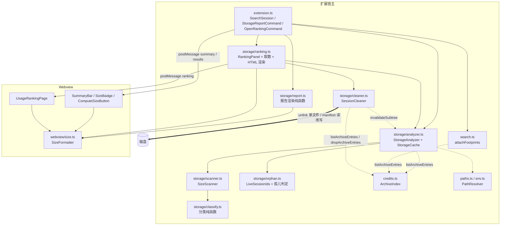

# Design Document

## Overview

本特性在 Kiro Chat Search（v0.4.3）中新增**存储占用统计**与**指定会话的清理**能力，回答三个问题并给出一个动作：Kiro 一共占了多少盘、是什么在占、哪次对话最重，以及——把选定的那次对话的执行存档（必要时连对话本身）删掉。

实地调研已经给出结论：吃盘的是**执行存档**（2.89 GB / 85%），对话 JSON 只有 27.6 MB。因此本设计的核心不是"扫目录算体积"这件事本身，而是**归因**：把执行存档的字节数按 `chatSessionId` 归到会话上，并把没有任何现存会话引用的存档单独识别为孤儿。归因同时是清理的前提——只有能把存档准确归到一个会话，才敢把它列进删除清单。

### 关键设计决策

| 决策 | 选择 | 理由 |
| --- | --- | --- |
| 存档字节数来源 | 复用 `credits.ts` 的 ArchiveIndex 已有的 `size` / `chatSessionId` | Requirement 7.1 明令不得为统计再读存档内容；索引条目已含这两个字段，零额外 IO |
| 分类实现 | 单次遍历 UserDataDir + 纯函数分类器把**每个文件**映射到**唯一**分类 | 天然保证 Requirement 1.9 的"和守恒 + 两两不相交"，不需要事后校正 |
| 会话归因 | 自身口径 `self` 可加、累计口径 `lineage` 不可加并显式标记 `additive` | 与既有 credit 的 `Σ` 开关口径完全对齐，避免两套语义 |
| 统计触发方式 | **显式手动触发**：ComputeSizeButton 左键 / UsageRankingPage 打开与刷新 / StorageReportCommand / 清理后刷新 | 全量枚举是数千次 stat 的 IO 密集操作，挂在"视图可见"上等于每次切换侧边栏都付一次代价（Requirement 4.2、7.12） |
| 排行页形态 | 独立 `WebviewPanel`，窗口内单例，恒 `self` 口径 | 需要表格布局、分页控件与逐行清理入口，塞不进侧边栏过滤行；恒 `self` 才能让"各行可相加"成立（Requirement 13.4） |
| 排行页翻页/换序 | 一次取全量数组下发，webview 端切片 | Requirement 7.13 要求翻页不回宿主重新枚举；50 条/页、上千会话量级的数组下发成本远低于一次全量 stat |
| 目录体积缓存 | 按目录路径缓存子树聚合，以 `(mtimeMs, 直接子条目数)` 失效 | 目录 mtime 只反映直接子项增删改名，配合子条目数可捕获绝大多数变化；代价是每次仍需一次 `readdir` 拿子条目数，但可跳过整棵子树递归 |
| 格式化器位置 | 放在 `src/webview/size.ts`，随既有 `injectedFormatScript()` 注入 webview | 与 `format.ts` / `filter.ts` 同一套"纯函数 + toString 注入"约定，宿主与前端共用同一实现（Requirement 10.8） |
| 写操作边界 | 两段式：ReadOnlyPaths 全程零写入；WritableFsAllowlist 只允许 SessionCleaner 使用单文件 `unlink` 与 SessionManifest 的 `readFile`/`writeFile` | Requirement 9.7、9.8：把"零写入"从全局口号收窄成可静态审查的模块边界，删除能力集中在一个模块里便于审查 |

### 精度约定（Requirement 10.3/10.6 的张力）

`KB`/`MB` 只保留 1 位小数时，单位低端的相对误差必然超过 1%（例：`1075 B` → `1.0KB` → 回解 1024，误差 4.7%）。因此近似往返性质的容差定义为：

```
|parse(format(n)) - n| <= max(0.01 * n, halfStep(format(n)))
```

其中 `halfStep` 为展示精度的半个最小刻度（1 位小数为 `0.05 * 单位因子`，2 位小数为 `0.005 * 单位因子`）。这与 Requirement 10.6 括注的"受展示精度限制"一致，属性测试按此上界断言。

### 只读边界与可写边界（ReadOnlyPaths / WritableFsAllowlist）

本特性的代码路径分成两段，边界写在导入语句上而不是注释里：

| 段 | 覆盖模块 | 允许的 fs API |
| --- | --- | --- |
| **ReadOnlyPaths** | `storage/analyzer.ts`、`storage/scanner.ts`、`storage/classify.ts`、`storage/orphan.ts`、`storage/report.ts`、`storage/ranking.ts` 的取数与渲染 | `readdir`、`lstat`/`stat`、`readFile`/`readFileSync` |
| **WritableFsAllowlist** | 仅 `storage/cleaner.ts` | 针对**单个文件**的 `unlink`、针对 SessionManifest 的 `readFile` + `writeFile` |

ReadOnlyPaths 中的任何模块都不导入写 API；SessionCleaner 不导入 `rm`、`rmdir`、`rename`、`cp` 或任何递归删除 API。这两条约束是 Property 14 的断言对象（Requirement 9.7、9.8、11.8），删除范围的封闭性另由 Property 27 断言（Requirement 11.9）。

### 非目标

不做孤儿存档的**批量清理**（理由见 `storage/orphan.ts` 一节与 Requirement 3.7：孤儿不归属排行页上任何可展示的会话行，无法满足"只删已枚举并展示给用户的具体文件"这一前提）、不做递归删除或删除目录本身、不做删除的撤销与回收站、不做持久化、不做后台常驻扫描。

## Architecture

新增一个 `src/storage/` 子模块，与既有模块的关系如下（虚线为只读复用，粗虚线为唯一的写路径）：



### 四条独立的数据流

设计上刻意把各条流水线拆开，互不阻塞，这是 Requirement 4.5、7.2、7.12、7.13 的直接结果：

**流水线 A — 结果角标（轻、同步、只覆盖展示中的结果集）**

```
searchSessionsInDir / listRecentSessions（已截断到 10 / 20 条）
  → attachFootprints()：会话 JSON 的 size 来自既有会话索引缓存
  → 存档字节数来自 credits.listArchiveEntries()（4 秒节流的进程内索引）
  → 写入 SearchHit 的 footprint* 字段随 results 一起下发
```

流水线 A 不做任何目录全量枚举（Requirement 7.2、7.7）：会话 JSON 大小本来就在 `search.ts` 的 `SessionIndexEntry.size` 里，存档大小本来就在 ArchiveIndex 里，两者都是既有缓存的复用。它是**唯一**随结果渲染自动发生的一条流。

**流水线 B — 手动触发的汇总（重、异步、可取消、有 60 秒缓存）**

```
左键点击 ComputeSizeButton（唯一入口）/ StorageReportCommand / 清理完成后的刷新
  → StorageAnalyzer.getSummary({ force: true })
  → StorageCache 命中且非 force？→ 直接返回
  → SizeScanner 遍历 UserDataDir（深度 ≤ 8，每 512 条让出事件循环）
  → 每个文件经 classify() 落到唯一 StorageCategory
  → OrphanCollector 收集 LiveSessionIds + ArchiveIndex 快照 → 孤儿字节数
  → StorageSummary → postMessage('summary', { state: 'ok' })
```

面板/视图变为可见时**不**进入这条流水线：SummaryBar 停在 `idle`，只展示提示文案（Requirement 4.2）。既有刷新按钮也不进入这条流水线，它只重新取搜索结果（Requirement 4.8）。

**流水线 C — 排行页取数与分页（重取数一次、分页纯前端）**

```
OpenRankingCommand / 右键 ComputeSizeButton
  → RankingPanel.showOrCreate()：窗口内单例，已存在则 reveal() 并保持 page/sortOrder
  → collectRankingRows()：枚举当前工作区 WorkspaceSessionDir 的全部 SessionFile（stat 取 size/mtime）
                        + listArchiveEntries() 按 chatSessionId 归因（恒 self 口径）
  → 一次性把**全量** RankingRow[] 与 RankingViewState 下发 webview
  → 翻页 / 换序：webview 端对已下发数组重排 + 切片，不回宿主（Requirement 7.13）
```

**流水线 D — 清理执行（唯一的写路径，串行、有确认、有审计）**

```
排行页行内点击「清理附件」/「全部删除」
  → SessionCleaner.plan(mode, sessionId)                      ← 只读
  → 审计写入 CleanupPlan（删除前先落痕，Requirement 14.17）
  → 模态确认（含 ReferencedArchive 的二次确认）
  → 路径边界校验（assertDeletable）→ 逐文件 re-stat 复核 → unlink（锁类错误重试 3×200ms）
  → SessionManifest 读改写（仅 FullCleanup）
  → 缓存失效（SubtreeCache 逐级 + ArchiveIndex 摘除）
  → 刷新 UI（排行页当前页 / SummaryBar / SizeBadge）
  → 审计写入明细（成功 / 失败 / 跳过三类）
```

### 分类的划分方式

分类器是纯函数，输入一个文件绝对路径与几个已解析的根路径，输出唯一分类。规则**按序**匹配，先命中者胜：

| 序 | 路径条件 | 分类 |
| --- | --- | --- |
| 1 | 位于 `<StoreRoot>/workspace-sessions` 下 | `对话 JSON` |
| 2 | 位于 `<StoreRoot>/<hex32>/<hash32("KIRO::EXECUTION::SAVES")>` 下 | `执行存档` |
| 3 | 位于 `<StoreRoot>/<hex32>/<hash32("KIRO::EXECUTION::METADATA")>` 下 | `执行索引` |
| 4 | 位于 `<StoreRoot>/<hex32>` 下的其余内容（含直接子文件） | `其他/未分类`（实测为源码文件快照） |
| 5 | 位于 `<UserDataDir>/logs` 下 | `运行日志` |
| 6 | 位于 `<UserDataDir>/User/workspaceStorage` 下 | `工作区存储` |
| 7 | 其余 | `其他文件` |

因为每个文件恰好被归入一个分类，"各分类字节数之和 = 总字节数"与"路径集合两两不相交"是构造性成立的，而不是靠事后校验（Requirement 1.9）。路径归属判断统一用 `path.relative(parent, child)` 后检查结果既不以 `..` 开头也不是绝对路径，从而按**路径段边界**比较而非裸前缀比较（Requirement 8.2）。BucketDir 名称按小写十六进制**区分大小写**精确比较（Requirement 8.3）。

同一套 `isUnder` 与桶名判定被 SessionCleaner 的路径边界校验复用——删除侧与统计侧对"这个文件是不是执行存档"必须给出同一答案，否则会出现"统计说是存档、删除说不在白名单"的裂缝。

### 遍历预算

`SizeScanner` 的四条硬约束都落在同一处循环里：

- 异步 API（`fs.promises.readdir/lstat`），每处理 512 个条目 `await` 一次 `setImmediate`（Requirement 7.3）
- 只 `readdir` + `lstat`，绝不 `open`/`read` 被统计文件（Requirement 7.4）
- 递归深度上限 8，超深子树计入 `skippedCount` 并置 `partial = true`（Requirement 7.8）
- 遇到符号链接不跟随，按链接自身条目字节数计入所在分类（Requirement 8.5）

体积口径统一为 `lstat().size`（逻辑字节数），展示文案注明与资源管理器"占用空间"的差异（Requirement 8.4、12.5）。

## Components and Interfaces

### 模块清单

| 文件 | 职责 | 读/写 |
| --- | --- | --- |
| `src/webview/size.ts` | SizeFormatter：字节数 ↔ 文本、角标与汇总文案（纯函数，注入 webview） | — |
| `src/storage/classify.ts` | 路径 → StorageCategory 的分类纯函数与 `isUnder` | — |
| `src/storage/scanner.ts` | SizeScanner 与 SubtreeCache | 只读 |
| `src/storage/orphan.ts` | LiveSessionIds 收集与孤儿判定 | 只读 |
| `src/storage/analyzer.ts` | StorageAnalyzer、StorageCache、会话归因、缓存失效入口 | 只读 |
| `src/storage/report.ts` | StorageReportCommand 的报告渲染纯函数 | — |
| `src/storage/ranking.ts` | **新增** RankingPanel（单例 webview）、排行取数、排序比较函数、HTML 渲染 | 只读 |
| `src/storage/cleaner.ts` | **新增** SessionCleaner：CleanupPlan、路径校验、删除、清单读改写、审计 | **唯一可写** |
| `src/credits.ts` | 既有 ArchiveIndex，新增只读快照导出与条目摘除入口 | 只读 |

`package.json` 需在 `contributes.commands` 中新增两条命令（`storageReport` 为既有设计中已规划、本次一并列出）：

```json
{ "command": "kiroChatSearch.storageReport",  "title": "Kiro: 存储占用分析" },
{ "command": "kiroChatSearch.storageRanking", "title": "Kiro: 存储占用排行" }
```

### `src/webview/size.ts` — SizeFormatter（纯函数，注入 webview）

```ts
/** 1024 进制，单位序列 B/KB/MB/GB/TB；B 取整，KB/MB 1 位小数，GB/TB 2 位小数。 */
export function formatSize(bytes: number): string;

/** formatSize 的逆向解析；输入 '-' 或不可识别文本时返回 NaN。 */
export function parseSize(text: string): number;

/** 结果角标的展示文本与 tooltip；scope 与既有 Σ 开关共用状态。 */
export function sizeBadgeLabel(opts: {
  scope?: 'self' | 'lineage';
  jsonBytes?: number;
  archiveBytesSelf?: number;
  archiveBytesLineage?: number;
  archivesFound?: boolean;
}): { value: string; title: string; warn: boolean } | null;

/** 汇总条文本；state 为 idle/loading/unavailable 时给出对应提示文案而非数值。 */
export function summaryLabel(opts: {
  state?: 'idle' | 'loading' | 'ok' | 'unavailable';
  totalBytes?: number;       // ProjectFootprintTotal
  resultSetBytes?: number;   // ResultSetFootprintTotal
  orphanBytes?: number;
  orphanState?: 'ok' | 'pending' | 'unknown';
  sessionCount?: number;
  resultCount?: number;
  categories?: Array<{ label: string; bytes: number; pathHint: string }>;
  partial?: boolean;
  skippedCount?: number;
}): { text: string; title: string } | null;
```

- 三者都不依赖 DOM 与 vscode，可直接被 vitest 测试，同时源码经 `injectedFormatScript()` 注入 webview（Requirement 10.8）。
- `summaryLabel` 的四态文案：`idle` → 「点击 ⛁ 统计占用」；`loading` → 「统计中…」；`ok` → 三项数值；`unavailable` → 「占用统计不可用」（Requirement 4.2、4.5、9.3）。`ok` 态下 `partial` 为 true 时数值前加 `≥` 并在 tooltip 给出 `skippedCount`（Requirement 4.11）；`categories` 存在时把分类明细追加到同一 tooltip（Requirement 4.10）。
- `sizeBadgeLabel` 在 `archivesFound === false` 时只展示 `jsonBytes` 并在 tooltip 说明存档不可用（Requirement 5.3）；在 `jsonBytes` 也缺失时返回 `null`，渲染层据此省略角标（Requirement 5.4）。
- `warn` 在总占用 ≥ `100 * 1024 * 1024` 时为 `true`，渲染层据此加警示配色类（Requirement 5.6）。

### `src/storage/classify.ts` — 分类纯函数

```ts
export type StorageCategory =
  | 'sessionJson' | 'executionSaves' | 'executionMetadata'
  | 'unclassified' | 'logs' | 'workspaceStorage' | 'otherFiles';

export interface ClassifyRoots {
  userDataDir: string;
  storeRoot: string;        // <UserDataDir>/User/globalStorage/kiro.kiroagent
  sessionsRoot: string;     // <storeRoot>/workspace-sessions
  savesBucket: string;      // hash32('KIRO::EXECUTION::SAVES')
  metadataBucket: string;   // hash32('KIRO::EXECUTION::METADATA')
  logsDir: string;          // <UserDataDir>/logs
  workspaceStorageDir: string; // <UserDataDir>/User/workspaceStorage
}

export function buildClassifyRoots(userDataDir: string): ClassifyRoots;
export function classifyPath(roots: ClassifyRoots, fullPath: string): StorageCategory;

/** 分类的中文标签与对应磁盘路径模板（供 tooltip 与报告展示）。 */
export const CATEGORY_META: Record<StorageCategory,
  { label: string; pathHint: string; note?: string }>;

/** 路径段边界归属判断，不做裸字符串前缀比较。 */
export function isUnder(parent: string, child: string): boolean;
```

`CATEGORY_META.unclassified.note` 固定标注"实测包含源码文件快照"（Requirement 1.6）。

### `src/storage/scanner.ts` — SizeScanner

```ts
export interface CategoryAgg { bytes: number; files: number }
export type CategoryTotals = Record<StorageCategory, CategoryAgg>;

export interface ScanResult {
  totals: CategoryTotals;
  totalBytes: number;
  totalFiles: number;
  skippedCount: number;
  cancelled: boolean;
}

export interface ScanOptions {
  roots: ClassifyRoots;
  maxDepth?: number;      // 默认 8
  yieldEvery?: number;    // 默认 512
  isCancelled?: () => boolean;
  /** 子树聚合缓存；缺省时使用模块级缓存 */
  cache?: SubtreeCache;
  fsDeps?: ScannerFsDeps; // 便于测试注入
}

export async function scanTree(root: string, opts: ScanOptions): Promise<ScanResult>;

/** 目录子树聚合缓存：键为目录绝对路径，(mtimeMs, 直接子条目数) 失效。 */
export class SubtreeCache {
  get(dir: string, mtimeMs: number, childCount: number): ScanResult | undefined;
  set(dir: string, mtimeMs: number, childCount: number, agg: ScanResult): void;
  /** 失效单个目录条目（供清理后的逐级失效使用） */
  invalidate(dir: string): void;
  clear(): void;
}
```

- `scanTree` 对每个目录先 `readdir(withFileTypes)`，据此得到直接子条目数，再查 `SubtreeCache`：命中则整棵子树直接复用聚合结果，不再递归（Requirement 7.6）。
- 常驻内存只保存"每个目录的聚合数字"，不保存文件列表、不保存文件内容，因此内存增量与被统计文件字节数无关（Requirement 7.11）。
- `isCancelled()` 在每个目录入口与每次让出后检查，取消时立即返回 `cancelled: true`，已完成的子树聚合已写入缓存供下次复用（Requirement 6.7）。

### `src/storage/orphan.ts` — LiveSessionIds 与孤儿判定

```ts
export interface LiveSessionsResult {
  ids: Set<string>;
  complete: boolean;   // 枚举与清单解析是否全部完成
  skippedCount: number;
  /** 每个工作区会话目录的字节数与会话文件大小，供报告与工作区排行复用 */
  byWorkspace: Array<{
    dirName: string;            // EncodedKey
    dirPath: string;
    decodedPath: string | null; // 解码失败时为 null
    sessionBytes: number;
    sessions: Array<{ sessionId: string; jsonBytes: number }>;
  }>;
}

export async function collectLiveSessions(sessionsRoot: string): Promise<LiveSessionsResult>;

export type OrphanState = 'ok' | 'pending' | 'unknown';

export interface OrphanStat {
  state: OrphanState;
  bytes: number;
  files: number;
  note: string;
}

/** 纯函数：给定存档条目与 LiveSessionIds 判定孤儿合计。 */
export function computeOrphans(
  archives: readonly ArchiveInfo[],
  live: { ids: ReadonlySet<string>; complete: boolean }
): OrphanStat;

/** EncodedKey → 工作区绝对路径；失败返回 null（调用方回退展示原始目录名）。 */
export function decodeWorkspaceKey(key: string): string | null;
```

`computeOrphans` 的状态判定顺序（Requirement 3.2、3.5）：

1. `live.complete === false` → `pending`，**不**判定任何存档
2. `live.ids.size === 0` → `unknown`，**不**把全部存档判为孤儿
3. 否则 → `ok`，把 `chatSessionId` 缺失或不在 `live.ids` 中的存档计入合计

`note` 固定包含两段内容：机制说明（Kiro 执行存档的 LRU 索引只淘汰内存条目，磁盘文件残留，Requirement 3.6）与限制理由（孤儿存档不归属排行页上任一可展示的会话行，因此仅统计、**不提供批量清理**入口，Requirement 3.7）。模块本身不导出任何删除入口。FullCleanup 删掉 SessionFile 与清单条目后，其残留存档会在下一次统计中自然落入孤儿集合（Requirement 3.8）——这是判定规则的推论，不需要额外代码。

### `src/credits.ts` — 只读快照导出与条目摘除

```ts
export interface ArchiveInfo {
  /** 存档文件绝对路径 */
  path: string;
  /** 文件名，即 hash32(executionId)，供 history executionId 反查 */
  name: string;
  size: number;
  chatSessionId: string | null;
}

/**
 * 返回 ArchiveIndex 的只读快照。内部走既有 refreshIndex（4 秒节流），
 * 不新增扫描策略、不读取存档内容。
 */
export function listArchiveEntries(
  storeRoot: string,
  opts?: { workspacePath?: string }
): ArchiveInfo[];

/**
 * 从 ArchiveIndex 中摘除指定绝对路径的条目，返回实际摘除的条目数。
 * 只删 Map 键，不触发扫描、不改节流状态；用于文件已被 SessionCleaner 删除后
 * 立即让索引与磁盘一致，避免 4 秒节流窗口内继续用陈旧条目算占用。
 */
export function dropArchiveEntries(paths: readonly string[]): number;
```

`credits.ts` 的改动只有这两个导出，内部的 `archiveCache`、`scanState`、`SCAN_TTL_MS = 4000` 与解析逻辑保持原样：

- `listArchiveEntries` 把已有 `archiveCache` 条目以只读形式暴露，`size` 与 `chatSessionId` 已在 `ArchiveEntry` 中，无需新增解析（Requirement 7.1）。刷新仍复用 4 秒节流窗口，包括用户主动刷新与执行命令时（Requirement 7.9、7.10）。
- `dropArchiveEntries` 是**唯一**新增的写状态入口，语义刻意做窄：它不接受 sessionId、不做匹配、不重建索引，只按绝对路径删键。这样 `credits.ts` 现有封装（谁能改 `archiveCache`、什么时候重扫）不被打破——外部无法用它触发扫描或改变节流，最坏情况只是让下一次查询重新解析这些路径（而它们已经不存在，`refreshIndex` 的"清理本次未见到的旧条目"逻辑会兜住）。

### `src/storage/analyzer.ts` — StorageAnalyzer

```ts
export interface AnalyzerDeps {
  pathResolver?: PathResolverDeps;
  workspacePath?: string | null;
}

export interface SummaryOptions {
  force?: boolean;               // 忽略 60 秒 StorageCache 有效期
  isCancelled?: () => boolean;
  onProgress?: (msg: string) => void;
}

export class StorageAnalyzer {
  constructor(deps?: AnalyzerDeps);
  getSummary(opts?: SummaryOptions): Promise<StorageSummary>;
  getReportData(opts?: SummaryOptions): Promise<StorageReportData>;
  /** 排行页取数：当前工作区全部会话，恒 self 口径 */
  getRankingRows(opts?: SummaryOptions): Promise<{
    rows: RankingRow[]; partial: boolean; skippedCount: number;
  }>;
  /**
   * 清理后的缓存失效：对每个被删文件，从其所在目录向上逐级 invalidate
   * SubtreeCache 直至 StoreRoot（含），并丢弃 StorageCache 的汇总结果。
   */
  invalidateForDeletedFiles(paths: readonly string[]): void;
  /** 测试辅助：清空 StorageCache 与 SubtreeCache */
  clearCache(): void;
}

/** 纯函数：由会话 JSON 大小 + 存档快照算出单会话占用。 */
export function computeSessionFootprint(
  input: {
    sessionId: string;
    jsonBytes: number;
    scope: 'self' | 'lineage';
    /** 该会话 history 引用的 executionId，用于 lineage 追溯（与 credit 一致） */
    historyExecutionIds?: readonly string[];
  },
  archives: readonly ArchiveInfo[]
): SessionFootprint;
```

- `getSummary` 在 `PathResolver` 返回 `null` 时直接返回 `status: 'unavailable'` 的 StorageSummary，不抛异常（Requirement 1.2）。
- StorageCache：`{ summary, scannedAt }`，TTL 60 秒；`force !== true` 且未过期则直接返回（Requirement 7.5）。所有用户显式触发（ComputeSizeButton 左键、排行页打开/刷新、StorageReportCommand、清理后刷新）都传 `force: true`，但**不**绕过 ArchiveIndex 的 4 秒节流（Requirement 7.10）。
- `computeSessionFootprint` 的 lineage 集合判定与既有 credit lineage 完全一致：把 `historyExecutionIds` 经 `hash32` 反查存档、取其 `chatSessionId` 并入集合（Requirement 2.2）。
- `scope === 'self'` → `additive: true`；`scope === 'lineage'` → `additive: false`（Requirement 2.4、2.5）。
- `invalidateForDeletedFiles` 的失效范围是"被删文件所在目录 → StoreRoot"这条链上的每个目录（Requirement 14.13）。之所以要逐级而不是只失效叶目录：SubtreeCache 缓存的是**子树聚合**，祖先目录的聚合值里含被删文件的字节数，而祖先目录自身的 `mtimeMs` 与直接子条目数并不因孙辈文件被删而变化，失效判据抓不到——必须显式打掉。

### `src/storage/report.ts` — 报告渲染

```ts
export interface StorageReportData {
  summary: StorageSummary;
  workspaces: Array<{ display: string; bytes: number; sessionBytes: number; execBytes: number }>;
  sessions: Array<{ sessionId: string; title: string; footprint: SessionFootprint }>;
  sessionLimit: number;   // 默认 50
  omittedSessions: number;
}

/** 纯函数：渲染四区块报告文本。 */
export function renderStorageReport(data: StorageReportData, now?: Date): string;
```

报告结构固定为四个区块（Requirement 6.2、6.4），**即使会话数为 0 也保留全部区块与"省略 0 条"字样**：

```
Kiro 存储占用分析 · 2025-01-01 12:00
用户数据目录: C:\Users\x\AppData\Roaming\Kiro
总占用: ≥4.50GB / 6317 个文件（逻辑字节数，不含簇对齐差异）

【1】分类构成
  执行存档       2.89GB   1280 个文件  <StoreRoot>\<workspaceId>\<hash32(SAVES)>
  ...
【2】按工作区排行
  1. 1.20GB  d:\Projects\Foo（会话 27.6MB + 执行数据 1.17GB）
【3】按会话排行（自身口径，可相加 · 前 50 条，省略 138 条）
  1. 12.3MB  会话 JSON 0.4MB + 存档 11.9MB  标题…（<sessionId>）
【4】孤儿存档合计
  2.10GB / 890 个文件
  说明: Kiro 执行存档索引为 LRU，只淘汰内存条目，磁盘文件残留…
        孤儿存档不归属排行页上任一会话行，故不提供批量清理入口；
        单个会话的清理请在「Kiro: 存储占用排行」页中操作。
```

会话排行固定使用自身口径以保证各行可相加（Requirement 6.9），排序按字节数降序（Requirement 6.3）。报告本身不提供任何清理入口（Requirement 6.10），孤儿区块的说明只否定"批量清理"，不再出现"本版本仅统计"这类会被误读为"整个特性没有清理能力"的表述（Requirement 6.11）。

### `src/storage/ranking.ts` — UsageRankingPage

**为什么单独成文件而不是塞进 `webview.ts`**：`webview.ts` 是搜索面板的单一 HTML 模板 + 注入脚本，已近 700 行；排行页有自己的 CSP、自己的 DOM 结构、自己的消息协议与自己的状态机，与搜索面板零共用（唯一共用的是 `size.ts` 的格式化函数，本来就是独立模块）。因此按既有"一个 webview 一个模板函数"的组织方式，新开 `ranking.ts` 承载取数 + 渲染 + 面板生命周期，与 `webview.ts` 保持同构而非嵌套。

```ts
/** 排行页面板：窗口内单例。 */
export class RankingPanel {
  static showOrCreate(context: vscode.ExtensionContext, deps: RankingDeps): void;
  /** 清理完成后由 SessionCleaner 的调用方触发的重取数 */
  refresh(opts?: { force?: boolean }): Promise<void>;
  dispose(): void;
}

export interface RankingDeps {
  analyzer: StorageAnalyzer;
  cleaner: SessionCleaner;
  workspacePath: string | null;
}

/** 取数（只读）：当前工作区全部会话，恒 self 口径。 */
export function collectRankingRows(input: {
  sessionDir: string;
  storeRoot: string;
  workspacePath: string;
  archives: readonly ArchiveInfo[];
}): { rows: RankingRow[]; skippedCount: number };

/** 排序比较函数（纯函数，可单测）。 */
export function compareRankingRows(
  a: RankingRow, b: RankingRow, order: 'desc' | 'asc'
): number;

/** 分页切片（纯函数）：返回第 page 页（1-based）的行与页码信息。 */
export function pageOf(
  rows: readonly RankingRow[], order: 'desc' | 'asc', page: number
): { rows: RankingRow[]; page: number; totalPages: number; total: number };

/** HTML 渲染（纯函数，除 cspSource/nonce 外不碰 vscode API）。 */
export function getRankingHtml(cspSource: string, nonce: string): string;

export const RANKING_PAGE_SIZE = 50;
```

**单例与状态保持**（Requirement 13.1）：模块级 `current: RankingPanel | undefined`。`showOrCreate` 命中已有实例时只 `panel.reveal()`，**不**重置 `page` 与 `sortOrder`（状态存活在 webview 侧的 `RankingViewState` 里，`retainContextWhenHidden: true` 保证隐藏不销毁）。`onDidDispose` 清掉 `current`，因此关闭后重开是全新 webview，自然回到 `page: 1` / `sortOrder: 'desc'`——状态"仅在实例存续期内保持"由生命周期本身保证，不需要额外的持久化或重置代码。

**排序比较函数的精确定义**（Requirement 13.5）：

```ts
function compareRankingRows(a, b, order) {
  if (a.totalBytes !== b.totalBytes) {
    return order === 'desc' ? b.totalBytes - a.totalBytes : a.totalBytes - b.totalBytes;
  }
  // tiebreak 恒定方向：mtime 降序 → sessionId 字典序升序，不随 order 反转
  if (a.mtimeMs !== b.mtimeMs) return b.mtimeMs - a.mtimeMs;
  return a.sessionId < b.sessionId ? -1 : a.sessionId > b.sessionId ? 1 : 0;
}
```

主键随 `order` 反转，tiebreak 恒定。这样同一输入在两个方向下各自唯一，且"占用相等的两行"在 `desc` 与 `asc` 下保持同一相对次序——用户点表头来回切换时，相等行不会莫名互换位置。`sessionId` 作为最后一级且在同一目录内唯一，因此比较函数是全序（Property 25）。

**分页**（Requirement 13.6、13.7）：`totalPages = max(1, ceil(K / 50))`（`K = 0` 时为 1），`page` 经 `clamp(1, totalPages)` 归一。翻页与换序都在 webview 端对已下发的全量 `rows` 做 `sort` + `slice`，不发消息回宿主（Requirement 7.13）。换序把 `page` 重置为 1（Requirement 13.8）；清理后行数减少时 `page = min(page, totalPages)`（Requirement 13.17）。

**状态机与控件禁用**（Requirement 13.9、13.15、13.16）：

| 状态 | 触发 | 展示 | 排序/翻页 | 刷新 | 清理 |
| --- | --- | --- | --- | --- | --- |
| `loading` | 打开、刷新、清理后重取 | 「统计中…」 | 禁用 | 禁用 | 禁用 |
| `ok` | 取数完成且 K > 0 | 当前页表格 + 「第 M / N 页 · 共 K 个会话」 | 启用（M=1 禁上一页、M=N 禁下一页） | 启用 | 启用 |
| `empty` | 取数完成且 K = 0 | 「当前项目还没有可统计的会话」+「第 1 / 1 页 · 共 0 个会话」，表头与分页控件结构保留 | 禁用 | 启用 | — |
| `no-workspace` | 无工作区 | 「未打开工作区，无法统计会话占用」，表头与分页控件保留并置灰 | 禁用 | 禁用 | — |
| `unavailable` | UserDataDir 为 null / 取数整体失败 | 「占用统计不可用」 | 禁用 | 启用 | — |

`loading` 期间面板始终可关闭；重复的统计请求被忽略（模块级 `inflight` 标志），保证同时最多 1 次统计在执行。`no-workspace` 状态下不发生任何目录枚举。

**partial 展示**（Requirement 13.10）：`≥` 前缀只加在「归因存档字节数」与「占用合计」两列（会话 JSON 字节数来自对单个文件的 stat，不受跳过影响，加 `≥` 反而是误导），页脚展示 `skippedCount`。

**CSP 与转义**（Requirement 13.13）：与 `webview.ts` 同一套 —— `default-src 'none'`；`style-src ${cspSource} 'unsafe-inline'`；`script-src 'nonce-${nonce}'`；`font-src`/`img-src` 同源。所有插入 DOM 的动态文本（会话标题、sessionId、审计与提示中的路径）一律先过 `escapeHtml`。标题按 Requirement 13.3 处理：空白 → `(无标题)`，超 120 字符 → 截断 + 省略号，完整标题放 `title` 属性（同样转义）。

**与 `Σ` 开关的关系**（Requirement 13.4）：排行页恒 `self`，不读也不写搜索面板的 `creditMode` 状态（两者是不同 webview，各自 `getState/setState` 互不可见），因此在排行页上的任何操作都不可能改变 `Σ` 开关。

**与 StorageReportCommand 的职责划分**（Requirement 6.10）：

| | UsageRankingPage | StorageReportCommand |
| --- | --- | --- |
| 范围 | 仅当前工作区的会话 | 全部工作区 + 分类构成 + 孤儿合计 |
| 形态 | 交互式 webview，分页/排序 | 输出通道纯文本，可整段复制 |
| 清理 | 每行两个入口 | 无 |
| 定位 | 操作面 | 一次性诊断快照 |

审计记录写入与报告相同的 OutputChannel，使"报告 + 删除记录"落在同一处可回溯的文本流里。

### `src/storage/cleaner.ts` — SessionCleaner（本特性唯一可写模块）

```ts
export type CleanupMode = 'attachment' | 'full';

export interface CleanerFsDeps {
  unlink: (p: string) => Promise<void>;
  stat: (p: string) => Promise<{ size: number; mtimeMs: number; isSymbolicLink(): boolean }>;
  readFile: (p: string, enc: 'utf8') => Promise<string>;
  writeFile: (p: string, data: string, enc: 'utf8') => Promise<void>;
  /** 重试等待；测试注入以免真的睡 200ms */
  delay?: (ms: number) => Promise<void>;
}

export interface CleanerDeps {
  fs?: CleanerFsDeps;                 // 缺省退回 fs.promises（含 lstat 作为 stat）
  audit: (lines: string[]) => void;   // 写 OutputChannel
  confirm: (p: ConfirmPrompt) => Promise<'confirm' | 'confirmWithReferenced' | 'cancel'>;
  archives: () => readonly ArchiveInfo[];
  invalidate: (deletedPaths: readonly string[]) => void; // analyzer + credits 摘除
  roots: { storeRoot: string; savesBucket: string; workspaceId: string; sessionDir: string };
}

export class SessionCleaner {
  constructor(deps: CleanerDeps);
  /** 只读：生成计划 */
  plan(mode: CleanupMode, sessionId: string, title: string): Promise<CleanupPlan>;
  /** 计划 → 确认 → 执行；全流程唯一入口 */
  run(mode: CleanupMode, sessionId: string, title: string): Promise<CleanupResult>;
}

/** 路径边界校验（纯函数，可单测）。返回 null 表示通过，否则返回拒绝原因。 */
export function assertDeletable(
  roots: { storeRoot: string; savesBucket: string; workspaceId: string; sessionDir: string },
  rawPath: string,
  opts: { isSymbolicLink: boolean }
): string | null;

/** SessionManifest 读改写（纯函数部分）：按原文风格序列化剩余条目。 */
export function removeManifestEntry(
  raw: string, sessionId: string
): { text: string; removed: number } | { error: string };
```

#### 执行流水线与各段失败语义

`run()` 按下表分段，**任何一段失败都不回滚已完成的段**——删除本身不可逆，回滚是假承诺；取而代之的是每段的结果都进入 CleanupResult 与审计（Requirement 9.9、14.12）。

| # | 段 | 失败语义 |
| --- | --- | --- |
| 0 | 互斥占位：`inflight.add(sessionId)`，已存在则拒绝并提示「该会话的清理正在进行」（Requirement 14.18） | 直接返回 `state: 'rejected'`，不写审计 |
| 1 | `plan()`：按 mode 收集待删文件（`chatSessionId` 区分大小写严格等于 sessionId；缺失/空/纯空白一律排除）、stat 取 `size`/`mtimeMs` 快照、分出 ReferencedArchive（Requirement 14.1–14.4） | 生成失败 → 抛给调用方 → 通知「会话清理失败：…」（Requirement 9.9）；空计划 → 返回 `state: 'noop'`，**不**弹确认（Requirement 14.7） |
| 2 | 审计写入 CleanupPlan（删除前先落痕，Requirement 14.17） | 审计写失败仅吞掉并继续（OutputChannel 写入失败不该阻止用户释放空间），但会在最终明细里注明 |
| 3 | 模态确认；若用户选择包含 ReferencedArchive → 按更新后的合计做二次确认（Requirement 14.5、14.6） | 取消/关闭 → `state: 'cancelled'`，文件与清单原样（Requirement 14.7） |
| 4 | 路径边界校验 `assertDeletable`（Requirement 14.19、8.6） | 拒绝的路径进 `failed[]`（含拒绝原因），继续处理其余路径 |
| 5 | 逐文件 re-stat 复核：不存在 → 跳过（释放 0 字节）；`size`/`mtimeMs` 与快照不一致 → 跳过（Requirement 14.20） | 跳过项进 `skipped[]`，不进 `failed[]` |
| 6 | `unlink` 单文件；`EBUSY`/`EPERM`/`EACCES`/`ELOCK` 类错误重试 3 次、间隔 200ms（Requirement 14.9） | 重试后仍失败或其它原因失败 → 进 `failed[]`，继续删其余文件（绝不中止） |
| 7 | SessionManifest 读改写（仅 `full`，Requirement 14.11） | 解析失败/非数组/写失败 → `manifestUpdated: 'failed'`，保留已完成的删除结果，不抛异常（Requirement 14.12） |
| 8 | 缓存失效：SubtreeCache 逐级 + `dropArchiveEntries`（Requirement 14.13） | 失效失败仅吞掉（最坏是数值滞后 60 秒），进审计 |
| 9 | 刷新 UI：排行页当前页、SummaryBar 三项、受影响会话的 SizeBadge（Requirement 14.14、4.12） | 刷新失败不影响删除结果 |
| 10 | 审计写入明细：逐条被删文件路径与字节数、逐条失败路径与原因、逐条跳过路径与原因、三类计数合计（Requirement 14.16） | — |
| 11 | `inflight.delete(sessionId)`（`finally` 中执行） | — |

段 4/5/6 对每个文件独立走完，因此"部分成功"是常态而非异常：`CleanupResult` 恒满足 `deletedFiles + failed.length + skipped.length === plan.totalFiles`（Property 29）。

#### 路径边界校验

`assertDeletable` 是纯函数，输入原始路径字符串与"是否符号链接"，输出 `null`（通过）或拒绝原因字符串。判定顺序：

1. 原始形式含 `..` 路径段 → 拒绝（`'含 .. 路径段'`）。**在规范化之前**判断，因为 `path.resolve` 会把 `..` 吃掉，规范化后就看不出来了
2. `path.resolve` 规范化后不满足 `isUnder(storeRoot, p)` → 拒绝（`'超出 StoreRoot'`）
3. 规范化后的路径等于 `<sessionDir>/sessions.json` → 拒绝（`'SessionManifest 不在删除范围'`）
4. 不匹配以下两类之一 → 拒绝（`'不匹配可删除位置'`）：
   - `isUnder(<storeRoot>/<workspaceId>/<savesBucket>, p)` 且 basename 为 hex32 → ExecutionArchive
   - `path.dirname(p) === sessionDir` 且 basename 形如 `<sessionId>.json` → SessionFile
5. `isSymbolicLink === true` → 拒绝（`'符号链接'`，Requirement 8.6）

拒绝集合可枚举、无 IO，因此可以直接做属性测试（Property 27）。校验复用 `classify.ts` 的 `isUnder`，与统计侧共用同一路径归属语义。

#### SessionManifest 读改写：保留原文风格

`removeManifestEntry(raw, sessionId)` 的做法是**探测原文风格后以同风格重新序列化**，而不是 `JSON.stringify(arr, null, 2)` 了事：

1. `JSON.parse(raw)`；非数组 → 返回 `{ error }`（Requirement 14.12）
2. 探测缩进：取原文第一个换行后的行首空白（`/\n([ \t]+)/` 的首个捕获组），得到 `'  '` / `'    '` / `'\t'`；探测不到则用 `'  '`
3. 探测行尾：原文含 `\r\n` → `'\r\n'`，否则 `'\n'`
4. 过滤掉 `sessionId` 匹配的条目，其余条目**保持原数组顺序**
5. `JSON.stringify(rest, null, indent)`，再把 `\n` 替换为探测到的行尾；原文以行尾结束则补上尾行

字段顺序天然保留：`JSON.parse` 保持对象键的插入顺序，`JSON.stringify` 按同序输出，未被移除的条目字段一个不动、一个不增（Requirement 14.11）。

**为什么不用临时文件 + rename**：这是常规的原子写做法，但本特性明确不采用，理由有三条——

- Requirement 9.8 把 WritableFsAllowlist 收窄到"单文件 `unlink` + SessionManifest 的 `readFile`/`writeFile`"。临时文件要 `writeFile` 到一个新路径再 `rename`，等于引入创建新文件与重命名两类操作，直接越界，也让"这个模块只会碰哪些路径"不再一眼可判。
- Requirement 14.11 明文要求"以单次 `writeFile` 覆盖写回，把临时文件与重命名排除在该路径之外"。
- 风险可接受：清单是 Kiro 会重建的索引而非用户数据的唯一副本，且删除已在段 2 落了审计。覆盖写在极端断电场景下可能留下截断的清单，代价是 Kiro 重新扫描目录重建标题索引——比"扩展在用户数据目录里留下临时文件残骸"更可接受。段 7 失败时 `manifestUpdated: 'failed'` 会明确告诉用户去检查清单。

#### 依赖注入

`CleanerFsDeps` 把四个 fs 调用都做成注入点，缺省退回 `fs.promises`。这么做不只为了方便 mock，更是为了让"调用面白名单"成为**可断言的事实**：属性测试注入一个记录所有调用的假 fs，断言出现的方法名集合 ⊆ `{ unlink, stat, readFile, writeFile }`，且 `unlink` 的实参集合 ⊆ CleanupPlan 的文件路径集合（Property 14(b)、27）。与既有 `PathResolverDeps` / `EnvCheckerDeps` / `ScannerFsDeps` 的做法保持一致。

### `src/extension.ts` — 命令与消息协议

新增两条命令：

- `kiroChatSearch.storageReport`（「Kiro: 存储占用分析」，Requirement 6.1），走 `withProgress` + 可取消：

```ts
vscode.window.withProgress(
  { location: vscode.ProgressLocation.Notification, title: 'Kiro 存储占用分析', cancellable: true },
  async (progress, token) => { /* analyzer.getReportData({ force: true, isCancelled: () => token.isCancellationRequested, onProgress }) */ }
);
```

结果写入模块级复用的 `OutputChannel` 并 `show()`（Requirement 6.6、6.8）。同一个 OutputChannel 被 CleanupAuditLog 复用（Requirement 14.16）。

- `kiroChatSearch.storageRanking`（「Kiro: 存储占用排行」，Requirement 13.1）→ `RankingPanel.showOrCreate(context, deps)`。

`SearchSession` 的消息协议变更：

| 方向 | 消息 | 说明 |
| --- | --- | --- |
| host → webview | `{ type: 'summary', state: 'idle' \| 'loading' \| 'ok' \| 'unavailable', summary? }` | 视图可见时推 `idle`（不统计）；收到 `computeSize` 后推 `loading`，完成推 `ok`，失败推 `unavailable`（Requirement 4.2、4.5、9.3） |
| webview → host | `{ type: 'computeSize' }` | **新增**：ComputeSizeButton 左键。宿主以 `force: true` 调 `getSummary` 并按当前结果集算 ResultSetFootprintTotal（Requirement 4.4、4.6） |
| webview → host | `{ type: 'openRanking' }` | **新增**：ComputeSizeButton 右键。宿主执行 `kiroChatSearch.storageRanking`，不改 SummaryBar 状态（Requirement 4.7） |
| webview → host | 既有 `hardRefresh` | 语义**收窄**为只重新取搜索结果，不再触发统计（Requirement 4.8） |
| webview → host | 既有 `revalidate` / `search` / `open` / `close` | 不变，均不触发统计（Requirement 7.7、7.12） |

宿主侧用一个 `summaryInflight` 标志忽略统计期间的重复 `computeSize`（前端也置忙碌态，双重保险）；统计以 `await` 于独立异步任务中进行，`results` 推送不等它，因此统计期间搜索与浏览照常可用（Requirement 4.5）。

### `src/webview.ts` — ComputeSizeButton / SummaryBar / SizeBadge

- **ComputeSizeButton**：`.filters` 行内、既有 `#creditMode`（`Σ`）**左侧**的 `<span id="computeSize" class="filter-chip" role="button">⛁ 占用</span>`。左键 → `postMessage({ type: 'computeSize' })`；`contextmenu` 事件监听器中先 `e.preventDefault()`（阻止 webview 默认上下文菜单）再 `postMessage({ type: 'openRanking' })`（Requirement 4.3、4.7）。tooltip 固定为「左键统计当前项目占用 · 右键打开占用排行」。忙碌态加 `.busy` 类（`pointer-events: none` + 降透明度）并在 `summary.state === 'loading'` 时开启、收到 `ok`/`unavailable` 时关闭，重复左键因此被忽略（Requirement 4.5）。
- **SummaryBar**：`.filters` 行内的 `<span id="summary" class="summary-bar">`，插在过滤 chip 与 ComputeSizeButton 之间；样式 `min-width: 0; overflow: hidden; text-overflow: ellipsis; white-space: nowrap`，宽度不足时省略号截断而不挤掉可点击控件（Requirement 4.9）。文本与 tooltip 全部由 `summaryLabel()` 产出，初始 `state: 'idle'`。
- **SizeBadge**：渲染在 `row1` 的 `.time` 容器内、credit 角标之前，复用 `.badge.usage` 的视觉规格并新增 `.badge.size` 与 `.badge.size.warn` 两个类（Requirement 5.1、5.6）。
- 既有 `$creditMode` 的 click 处理里同时切换 SizeBadge 的 `scope`，一次重渲染同时更新两个角标（Requirement 5.2）；两个口径的数值都随 `results` 一次下发，切换不触发取数。

## Data Models

```ts
/** 分类明细 */
export interface CategoryStat {
  category: StorageCategory;
  label: string;        // 中文标签，如 '执行存档'
  pathHint: string;     // 对应磁盘路径模板，供 tooltip / 报告
  note?: string;        // 如 '实测包含源码文件快照'
  bytes: number;
  files: number;
}

/** 一次汇总统计的结果 */
export interface StorageSummary {
  status: 'ok' | 'unavailable';
  userDataDir: string | null;
  totalBytes: number;
  totalFiles: number;
  categories: CategoryStat[];
  /** 当前工作区归属 = WorkspaceSessionDir + <StoreRoot>/<WorkspaceId> */
  currentWorkspaceBytes: number;
  /** 当前工作区全部会话的 SelfFootprint 合计（ProjectFootprintTotal） */
  projectFootprintTotal: number;
  orphan: OrphanStat;
  /** 存在跳过条目（不可读 / 超深）时为 true，表示数值为下限 */
  partial: boolean;
  skippedCount: number;
  /** 参与统计的会话数，供 SummaryBar tooltip 展示 */
  sessionCount: number;
  /** 体积口径说明文案，固定注明为 stat 逻辑字节数 */
  sizeNote: string;
  scannedAt: number;
}

/** 单会话占用 */
export interface SessionFootprint {
  sessionId: string;
  scope: 'self' | 'lineage';
  /** self 可跨会话求和；lineage 不可 */
  additive: boolean;
  jsonBytes: number;
  archiveBytes: number;
  totalBytes: number;
  /** 是否找到任何归因到该会话的存档 */
  archivesFound: boolean;
}
```

### 排行页数据模型

```ts
/** 排行页的一行；恒为 self 口径，故不带 scope/additive 字段 */
export interface RankingRow {
  /** 会话标题（清单优先，回退单文件标题）；渲染前截断与转义 */
  title: string;
  sessionId: string;
  jsonBytes: number;
  /** 归因到该会话的存档字节数（self 口径） */
  archiveBytesSelf: number;
  /** jsonBytes + archiveBytesSelf，排序主键 */
  totalBytes: number;
  /** SessionFile 的 mtime，展示为 YYYY-MM-DD HH:mm，同时是 tiebreak 主键 */
  mtimeMs: number;
}

/** 排行页的视图状态；存活在 webview 侧，随面板实例存续 */
export interface RankingViewState {
  sortOrder: 'desc' | 'asc';
  /** 1-based 当前页码，恒满足 1 ≤ page ≤ totalPages */
  page: number;
  /** K：当前工作区可统计会话数 */
  totalSessions: number;
  /** N = max(1, ceil(K / 50)) */
  totalPages: number;
  /** 与 StorageSummary.partial 同源；true 时存档列与合计列加 ≥ 前缀 */
  partial: boolean;
  skippedCount: number;
}
```

`RankingRow` 刻意不含 `archiveBytesLineage`：排行页恒 `self`，下发 lineage 数值只会诱导出"两列可以相加"的误用。

### 清理数据模型

```ts
export type CleanupMode = 'attachment' | 'full';

/** 一次清理的预演结果（只读产出） */
export interface CleanupPlan {
  /** 生成时间，进审计与 TOCTOU 复核的语境 */
  createdAt: number;
  mode: CleanupMode;
  sessionId: string;
  title: string;
  /** 待删除文件；size/mtimeMs 为快照，供确认后的 re-stat 复核比对 */
  files: Array<{ path: string; size: number; mtimeMs: number }>;
  totalBytes: number;
  totalFiles: number;
  /** 被其它现存会话 lineage 引用、默认被排除的存档 */
  referenced: Array<{ path: string; size: number }>;
  referencedBytes: number;
  referencedFiles: number;
  /** 仅 full：把从 SessionManifest 移除该 sessionId 列为附加操作 */
  manifestUpdate: { path: string; sessionId: string } | null;
}

/** 一次清理的执行结果 */
export interface CleanupResult {
  state: 'done' | 'cancelled' | 'noop' | 'rejected';
  mode: CleanupMode;
  sessionId: string;
  deletedFiles: number;
  deletedBytes: number;
  /** 校验拒绝、符号链接、重试后仍失败等 */
  failed: Array<{ path: string; reason: string }>;
  /** re-stat 复核为已不存在或与快照不一致而未删 */
  skipped: Array<{ path: string; reason: 'missing' | 'changed' }>;
  /** 三态：'skipped' 表示非 full 模式或无需更新 */
  manifestUpdated: 'ok' | 'failed' | 'skipped';
  /** 用户是否显式选择包含 ReferencedArchive */
  includedReferenced: boolean;
}
```

`SearchHit` 扩展字段（`src/search.ts`，全部可选，取不到时省略，渲染层据此省略角标）：

```ts
export interface SearchHit {
  // …既有字段…
  /** 会话 JSON 自身字节数 */
  sessionJsonBytes?: number;
  /** 自身口径归因存档字节数 */
  archiveBytesSelf?: number;
  /** 累计口径归因存档字节数（含 checkpoint 祖先链） */
  archiveBytesLineage?: number;
  /** 是否找到归因存档；false 表示只展示 JSON 部分 */
  archivesFound?: boolean;
}
```

设计上不把两个口径的"总量"下发，只下发 `jsonBytes` 与两个 `archiveBytes`，由前端相加得到展示值——这样 tooltip 的拆解行（Requirement 5.5）与角标数值必然一致，不存在两处口径漂移的可能。

## 删除操作的安全设计

清理是本特性唯一的破坏性能力，且删的是用户数据目录里的真实文件。这一节把安全设计的每条选择连同理由写清楚，供审查。

### 为什么只删已枚举文件

`unlink` 的实参只能来自 `CleanupPlan.files[].path`——这个集合在段 1 一次性算定，之后不再增长。三条推论：

- **用户看到的就是要删的**：确认提示里的文件数与字节数正是这个集合的合计，不存在"确认时说 12 个、实际删了 15 个"。
- **计划生成后新出现的文件一律不删**（Requirement 14.8）。这不是遗漏而是刻意：Kiro 可能在用户思考确认框的这几秒里为同一会话写出新的执行存档，删掉它等于删掉用户确认范围之外的东西。少删一个文件的代价是用户再点一次；多删一个的代价无法挽回。
- **没有目录操作**：集合里只有文件路径，模块不导入任何递归删除或目录删除 API。因此"扩展误删了一整个目录"这类事故在代码层面不可能发生，而不是靠运行时判断避免。

### 为什么做路径边界校验

计划里的路径来自 ArchiveIndex 与会话目录枚举，看起来可信。但可信来源不等于可信数据：ArchiveIndex 的键是拼接出来的路径，会话目录名来自磁盘，任何一处若被构造成含 `..` 的形式，`unlink` 就可能落在 StoreRoot 之外。`assertDeletable` 把这件事变成显式的、可枚举的、可单测的判定（Requirement 14.19）：

- 先查 `..` 段再规范化——顺序反了就永远查不出来，因为 `path.resolve` 会把 `..` 消掉
- 规范化后必须落在 StoreRoot 内，且必须匹配两类白名单位置之一（ExecutionSavesBucket 下的 hex32 存档、当前工作区 WorkspaceSessionDir 下的 `<sessionId>.json`）
- SessionManifest 被单独拒绝：它是清单不是会话，全量清理时要改它而不是删它
- 符号链接一律拒绝（Requirement 8.6）：`unlink` 一个链接删的是链接本身，但判断"这是链接还是真文件"的时机与删除时机之间同样存在窗口，且链接的存在本身就说明这条路径不是我们预期的存档文件，拒绝比猜测安全

白名单式判定（默认拒绝、显式放行）而不是黑名单式（默认放行、排除危险模式），因为后者的完备性无法论证。

### 为什么做 TOCTOU 复核

计划生成与实际删除之间隔着一次模态确认——用户可能想了三十秒，期间 Kiro 仍在跑。如果一个存档在这期间被改写（同路径、新内容），直接 `unlink` 就删掉了用户没看过的数据。段 5 的 re-stat 复核把 `size` 与 `mtimeMs` 与快照比对（Requirement 14.20）：

- 文件已不存在 → 跳过，释放 0 字节。目标已达成，不算失败
- `size` 或 `mtimeMs` 变了 → **不删**，计入跳过。字节数变了说明内容变了，用户确认的那个文件已经不是这个文件
- 完全一致 → 删

跳过与失败在 CleanupResult 中分列（Requirement 14.10），因为两者对用户的含义不同：失败是"想删没删掉，可以重试"，跳过是"情况变了，故意没删，重新统计后再看"。`(size, mtimeMs)` 不是密码学校验，改写后恰好同大小同 mtime 的情况理论上存在，但那需要在毫秒精度的 mtime 上撞上——相对成本而言这个强度是合适的权衡。

### 为什么不提供撤销与回收站

- **回收站不可用**：Node 的 `fs` 没有回收站语义，走回收站需要平台 shell API（Windows 的 `SHFileOperation`、macOS 的 `NSFileManager`）或第三方原生依赖。为一个搜索扩展引入原生模块，换来的可靠性提升不成比例，而且回收站里躺着几 GB 存档等于没释放空间——与用户点这个按钮的目的直接冲突。
- **撤销不可用**：撤销需要先把文件复制到别处，那是"写入几 GB 数据后再删除"，既违反 WritableFsAllowlist，也在磁盘已经紧张的场景下适得其反。
- **因此把成本前移到确认环节**：模态确认必须给出清理模式、释放字节数、文件数、被保留的引用冲突文件数，以及"不可撤销、不进回收站"的明文说明；「取消」是默认按钮，确认项处于非默认位置，误按回车不会删数据（Requirement 14.5）。选择包含 ReferencedArchive 时还有二次确认，并明说"其它会话的历史 credit 用量将无法回溯"（Requirement 14.6）。

### 审计记录如何支撑事后追溯

审计分两次写入同一个 OutputChannel（与 StorageReportCommand 共用，Requirement 14.16、14.17）：

1. **删除前**写 CleanupPlan：时间、模式、目标 sessionId 与标题、每个待删文件的绝对路径与字节数、合计、被保留的 ReferencedArchive。这次写入的意义在于**删除失败或进程中断时仍有清单**——如果只在结束时写，崩在段 6 中间就什么都不知道了。
2. **删除后**写明细：每个被删文件的路径与字节数、每个失败文件的路径与原因、每个跳过文件的路径与原因、成功/失败/跳过三类计数合计、`manifestUpdated` 结果。

这样"哪些文件在什么时候被这个扩展删了"可以逐条核对；配合同一通道里的存储占用报告，用户能把"删之前多大、删了什么、删之后多大"连成一条线。审计只写输出通道、不落盘文件——落盘会引入新的写路径与生命周期管理（谁清理、多大轮转），而输出通道天然随窗口存续、可复制、可粘贴到 issue。

## Correctness Properties

*属性（property）是在系统所有合法执行下都应成立的特征或行为——一种关于"系统应当做什么"的形式化陈述。属性是人类可读的规格说明与机器可验证的正确性保证之间的桥梁。*

本特性的核心逻辑是纯粹的数据变换（路径 → 分类、存档 → 会话归因、字节数 → 文本、排序 → 分页切片）与集合关系（待删集合 → 实删集合），输入空间大（任意目录树、任意存档分布、任意字节数、任意失败位置）且存在明确的守恒律、往返关系与拒绝集合，因此适合属性测试。

### Property 1: 分类构成 UserDataDir 上的一个划分

*对任意* 目录树夹具与任意路径，`classifyPath` 恒返回单一分类（全域性），且同一路径不会被两个分类同时覆盖（互斥性）；扫描结果满足 `Σ categories[i].bytes === totalBytes` 与 `Σ categories[i].files === totalFiles`。生成器需覆盖同前缀兄弟目录（如 `logs` 与 `logs-old`）以验证按路径段边界比较，以及桶名的大写变体以验证区分大小写匹配。

**Validates: Requirements 1.3, 1.4, 1.5, 1.6, 1.7, 1.8, 1.9, 8.2, 8.3**

### Property 2: 当前工作区归属等于两处目录之和

*对任意* 夹具，`currentWorkspaceBytes` 恒等于当前工作区的 WorkspaceSessionDir 字节数与 `<StoreRoot>/<WorkspaceId>` 字节数之和。

**Validates: Requirements 1.10**

### Property 3: 自身口径归因公式

*对任意* 会话 JSON 字节数与任意存档集合（含空集合），自身口径占用恒等于「该会话 JSON 字节数 + 所有 `chatSessionId` 等于该 sessionId 的存档字节数之和」；当匹配集合为空时占用等于 JSON 字节数本身且 `archivesFound === false`。

**Validates: Requirements 2.1, 2.8**

### Property 4: 两种口径的关系与可加性标记

*对任意* 会话与存档夹具，累计口径的存档部分恒不小于自身口径的存档部分（`lineage ⊇ self`），且其 lineage 集合恒等于既有 credit lineage 的判定结果（顺 `history[].executionId` 经 `hash32` 反查所属会话）；`scope === 'self'` 恒对应 `additive === true`，`scope === 'lineage'` 恒对应 `additive === false`。

**Validates: Requirements 2.2, 2.4, 2.5**

### Property 5: 归因守恒

*对任意* 会话与存档夹具，`Σ(所有 LiveSessionIds 的自身口径存档部分) + 孤儿存档字节数 === 执行存档分类总字节数`，即每个存档恰好被归因到一个会话或被判为孤儿，不重不漏。

**Validates: Requirements 2.3**

### Property 6: 非会话数据被排除在会话占用之外

*对任意* 夹具，向 SessionManifest（`sessions.json`）或 UnclassifiedBucket（源码文件快照）追加任意字节，所有会话的占用数值恒保持不变；同时 manifest 的增量恒计入 `对话 JSON` 分类总量。

**Validates: Requirements 2.6, 2.7**

### Property 7: 统计幂等且缓存透明

*对任意* 未发生变化的夹具，连续两次统计恒返回相同的 StorageSummary 与相同的会话占用数值；且冷缓存（首次）与热缓存（复用 SubtreeCache / StorageCache）下的统计结果恒相等。

**Validates: Requirements 2.9, 7.6, 11.5**

### Property 8: LiveSessionIds 为两个来源的并集

*对任意* 会话文件名集合与任意 SessionManifest 条目集合，`LiveSessionIds` 恒等于两者 sessionId 的并集，且 `sessions.json` 自身不被当作会话记录计入。

**Validates: Requirements 3.1**

### Property 9: 孤儿判定的状态与集合

*对任意* 存档集合与任意 LiveSessionIds 输入：枚举未完成（`complete === false`）时状态恒为 `pending` 且孤儿字节数与文件数恒为 0；`ids` 为空且枚举完成时状态恒为 `unknown` 且孤儿字节数恒为 0；其余情形状态恒为 `ok` 且孤儿集合恒等于「`chatSessionId` 缺失或不属于 `ids`」的存档集合，其字节数与文件数为该集合的合计。

**Validates: Requirements 3.2, 3.3, 3.4, 3.5**

### Property 10: SummaryBar 输出覆盖三项数值、四态文案与下限标记

*对任意* SummaryBar 输入：`state === 'ok'` 时文本恒同时包含 ProjectFootprintTotal、ResultSetFootprintTotal 与孤儿存档占用三项格式化数值，tooltip 恒给出会话 JSON 与归因存档字节数的拆解、参与统计的会话数与结果条数，且当分类明细存在时恒为每个 StorageCategory 追加标签、格式化字节数与对应磁盘路径；`state` 为 `idle` / `loading` / `unavailable` 时恒输出对应提示文案且恒不含任何占用数值；输出含 `≥` 前缀与 `partial === true` 恒等价，且 partial 时 tooltip 恒包含被跳过的条目数。

**Validates: Requirements 4.1, 4.2, 4.5, 4.10, 4.11, 9.3**

### Property 11: SizeBadge 渲染与鲁棒性

*对任意* 角标输入（含随机缺失字段的输入）：`scope` 为 `self` / `lineage` 时展示值恒等于对应口径的 `jsonBytes + archiveBytes` 的格式化结果；`archivesFound === false` 时展示值恒等于 `jsonBytes` 的格式化结果且 tooltip 恒含存档不可用说明；tooltip 恒分行给出 JSON 与存档字节的拆解且两者之和的格式化结果恒等于角标数值；`warn === true` 与「总占用 ≥ 100 MB」恒等价；数值无法取得时恒返回 `null`（渲染层省略该条角标），且同一结果数组中其余条目的角标恒不受影响。

**Validates: Requirements 5.2, 5.3, 5.4, 5.5, 5.6, 9.6**

### Property 12: 报告结构不变量

*对任意* StorageReportData（含空的工作区列表与空的会话列表），报告文本恒包含四个区块（分类构成、按工作区排行、按会话排行、孤儿存档合计）；工作区与会话行恒按字节数降序；会话行数恒不超过 `sessionLimit`（默认 50）且「省略 N 条」中的 `N` 恒等于总条数减去展示条数；会话排行的每一行口径恒为 `self`（`additive === true`）。

**Validates: Requirements 6.2, 6.3, 6.4, 6.9**

### Property 13: EncodedKey 解码往返与失败回退

*对任意* 工作区绝对路径，`decodeWorkspaceKey(encodeWorkspaceKeys(p)[0])` 恒返回 `p`；*对任意* 非法或无法解码为合法路径的目录名，报告展示文本恒回退为原始目录名且恒非空。

**Validates: Requirements 6.5**

### Property 14: 两段式调用面约束（统计路径只读 / 删除路径白名单）

本属性分两半，共用同一套记录型文件系统夹具。

**（a）统计路径只读**：*对任意* 夹具，一次完整的 ReadOnlyPaths 执行（含汇总统计、会话占用计算、报告生成与 UsageRankingPage 取数）前后夹具目录树的快照（路径集合、每个文件的字节数与 mtime）恒完全相等；该执行期间出现的文件系统调用名集合恒为 `{ readdir, lstat, stat, readFile, readFileSync }` 的子集，恒不含任何创建、写入、重命名、移动或删除调用（含临时文件），且恒不对被统计文件或 ExecutionArchive 执行打开/读取内容的调用——存档内容的读取恒只发生在既有 credit 索引模块中。

**（b）删除路径白名单**：*对任意* CleanupPlan 与任意失败分布，一次 `SessionCleaner.run()` 期间出现的文件系统调用名集合恒为 `{ unlink, stat, readFile, writeFile }` 的子集，恒不含递归删除、目录删除、重命名或移动调用；`writeFile` 的实参路径恒只有 SessionManifest 一个，且仅在 `mode === 'full'` 时出现。

**Validates: Requirements 6.8, 7.1, 7.4, 9.7, 9.8, 11.8, 13.14**

### Property 15: 非显式动作恒不触发全量枚举

*对任意* 关键词、任意结果集与任意「视图变为可见 / 输入关键词 / 切换过滤 / 点击既有刷新按钮 / 无工作区下打开排行页」的动作序列，`scanTree` 恒不被调用、目录枚举调用次数恒为 0，且为渲染结果角标而访问的路径集合恒不包含其它工作区的目录；全量枚举恒只在显式动作（左键 ComputeSizeButton、打开或刷新 UsageRankingPage、StorageReportCommand、清理后的刷新）后发生。

**Validates: Requirements 4.2, 4.8, 7.2, 7.7, 7.12, 13.16**

### Property 16: 扫描预算

*对任意* 目录树夹具：处理 `n` 个目录条目时让出事件循环的次数恒不少于 `floor(n / 512)`；递归深度超过 8 层的子树恒被计入 `skippedCount` 且使 `partial === true`，深度不超过 8 层时恒不因深度产生跳过；SubtreeCache 中每个条目恒只含固定的数字与分类字段（不含文件内容或文件列表），因此缓存的序列化体积恒与被统计文件的字节数无关。

**Validates: Requirements 7.3, 7.8, 7.11**

### Property 17: 统计根恒由 PathResolver 派生

*对任意* 注入的平台、环境变量与 homedir 组合，`ClassifyRoots` 的每个成员路径恒以 PathResolver 返回的 UserDataDir 为前缀，恒不出现硬编码的平台专属绝对路径。

**Validates: Requirements 8.1**

### Property 18: 符号链接不被跟随

*对任意* 含符号链接（指向目录或文件）的夹具，统计总量恒不随链接目标的体积增加而增加，链接自身恒按其所在路径的分类计入一个条目，且统计恒能终止（不因循环链接而不终止）。

**Validates: Requirements 8.5**

### Property 19: 异常降级为跳过计数

*对任意* 随机的失败位置集合（枚举或 stat 抛异常），统计恒不抛出异常给调用方，`skippedCount` 恒等于失败条目数，`partial === true` 与 `skippedCount > 0` 恒等价，且所有未失败条目的字节数恒被完整计入。

**Validates: Requirements 9.1, 9.2**

### Property 20: 格式化形态与非法输入占位

*对任意* 有限非负字节数，`formatSize` 输出的单位恒取自 `B`/`KB`/`MB`/`GB`/`TB` 且与量级对应：`< 1024` 恒为整数加 `B`；`[1024, 1024³)` 恒保留 1 位小数；`≥ 1024³` 恒保留 2 位小数。*对任意* 负数、`NaN` 或非有限数输入，恒返回 `-`。

**Validates: Requirements 10.1, 10.2, 10.3, 10.4, 10.7**

### Property 21: 格式化单调性

*对任意* 两个有限非负字节数 `a <= b`，恒有 `parseSize(formatSize(a)) <= parseSize(formatSize(b))`。生成器需偏置到 1024 的各次幂附近以覆盖单位切换边界。

**Validates: Requirements 10.5**

### Property 22: 格式化近似往返

*对任意* 有限非负字节数 `n`，恒有 `|parseSize(formatSize(n)) - n| <= max(0.01 * n, halfStep(formatSize(n)))`，其中 `halfStep` 为展示精度的半个最小刻度（1 位小数为 `0.05 × 单位因子`，2 位小数为 `0.005 × 单位因子`）。

**Validates: Requirements 10.6**

### Property 23: 目录聚合可加性

*对任意* 目录树夹具中的任一目录，其统计字节数与文件数恒等于其直接子条目（子文件与子目录聚合）的字节数与文件数之和。

**Validates: Requirements 11.4**

### Property 24: 排行页取数与行渲染

*对任意* 会话目录夹具与任意存档集合：`collectRankingRows` 返回的行集合的 sessionId 集合恒等于该目录下全部 SessionFile 的 sessionId 集合（不受搜索结果条数截断影响），每行的 `totalBytes` 恒等于 `jsonBytes + archiveBytesSelf` 且 `archiveBytesSelf` 恒为自身口径归因结果，`mtimeMs` 恒取自该 SessionFile 的 stat。*对任意* 行输入（生成器覆盖空白标题、超长标题、含 `<`/`>`/`&`/引号的标题与 sessionId），渲染出的行文本恒包含六列信息、标题为空或纯空白时恒展示 `(无标题)`、标题长度超过 120 时恒展示前 120 字符加省略号且完整标题恒出现在该行的 `title` 属性中、最后修改时间恒形如 `YYYY-MM-DD HH:mm`，且所有动态文本恒经 HTML 转义（渲染结果中恒不出现未转义的 `<` 开始的标签）；`partial === true` 时 `≥` 前缀恒只出现在归因存档字节数与占用合计两列，恒不出现在会话 JSON 字节数列。

**Validates: Requirements 13.2, 13.3, 13.10, 13.13**

### Property 25: 分页恒为全量排序序列的切片

*对任意* 行集合（含空集合）、任意 RankingSortOrder 与任意页码序列：总页数 `N` 恒等于 `max(1, ceil(K / 50))`（`K = 0` 时恒为 1）、当前页码恒满足 `1 ≤ M ≤ N`；第 `M` 页的行序列恒等于「全量行按 `compareRankingRows` 排序后」的 `[(M-1)*50, M*50)` 切片，页内条目数恒不超过 50；`1..N` 各页行集合的并集恒等于全量行集合且两两不相交；切换 RankingSortOrder 后当前页恒为 1；行数减少后当前页恒为 `min(M, N)`。`pageOf` 与 `compareRankingRows` 恒为纯函数，翻页与换序恒不产生任何文件系统调用。

**Validates: Requirements 7.13, 11.11, 13.6, 13.7, 13.8, 13.17**

### Property 26: 排序比较函数为全序且 tiebreak 不随方向反转

*对任意* 两行 `a`、`b` 与任意方向 `order`，恒有 `sign(compare(a, b, order)) === -sign(compare(b, a, order))`（反对称）；*对任意* 三行，比较关系恒满足传递性；*对任意* 两行，`compare(a, b, order) === 0` 恒等价于「`totalBytes`、`mtimeMs` 与 `sessionId` 三者全部相等」（完全性，故同一输入的排序结果唯一）；*对任意* 两个 `totalBytes` 相等的行，`compare(a, b, 'desc')` 与 `compare(a, b, 'asc')` 恒同号（tiebreak 恒为「mtime 降序 → sessionId 字典序升序」，不随方向反转）。

**Validates: Requirements 13.5**

### Property 27: CleanupPlan 的集合定义与封闭性

*对任意* 存档集合（生成器覆盖 `chatSessionId` 缺失、空字符串、纯空白、大小写变体与相似 sessionId）与任意模式：`plan.files` 的路径集合恒等于定义式给出的集合——`attachment` 模式恒为「`chatSessionId` 与目标 sessionId 区分大小写严格相等的 ExecutionArchive」，`full` 模式恒为该集合并上目标会话的 SessionFile；`chatSessionId` 缺失/空/纯空白的存档恒不属于任何会话的计划；SessionManifest 恒不属于 `plan.files`，且 `full` 模式下 `manifestUpdate` 恒非 `null`；`plan.files` 与 `plan.referenced` 恒不相交，`referencedBytes` 恒等于 `referenced` 的字节和，`plan.totalBytes` / `totalFiles` 恒等于 `files` 的合计；每个条目恒含 `path`、`size`、`mtimeMs` 三个字段。

*对任意* 计划与任意随机失败分布，执行期间 `unlink` 的实参集合恒为 `plan.files` 的路径集合的子集，恒不含任何目录路径，且恒不含"确认之后才在夹具中出现的新文件"；用户取消确认时 `unlink` 恒不被调用且夹具目录树快照恒不变；空计划恒不触发确认提示且恒返回未执行状态。

**Validates: Requirements 11.9, 14.1, 14.2, 14.3, 14.4, 14.7, 14.8**

### Property 28: 路径边界校验的拒绝集合

*对任意* 路径输入，`assertDeletable` 恒返回 `null`（通过）当且仅当该路径同时满足：原始形式不含 `..` 路径段、规范化后位于 StoreRoot 之内、不等于 SessionManifest、匹配「当前工作区 ExecutionSavesBucket 下的 hex32 存档」或「当前工作区 WorkspaceSessionDir 下的 `<sessionId>.json`」之一、且不是符号链接。生成器需覆盖五类拒绝向量（含 `..` 段、越出 StoreRoot、指向 SessionManifest、位于其它桶或其它工作区目录、符号链接）与两类通过向量；*对任意* 被拒绝的路径，其恒进入 `CleanupResult.failed` 并带拒绝原因，且恒不被 `unlink`。

**Validates: Requirements 8.6, 14.19**

### Property 29: TOCTOU 复核的三分支跳过语义

*对任意* 「计划快照 `(size, mtimeMs)`」与「删除前复核所得的当前状态」的组合：当前状态为"文件不存在"时该文件恒被跳过、恒不被 `unlink`、恒按释放 0 字节计入跳过计数；当前 `size` 或 `mtimeMs` 与快照不一致时该文件恒不被 `unlink` 且恒计入跳过计数；两者完全一致时该文件恒被 `unlink` 且其字节数按快照计入释放量。跳过项恒不出现在 `failed[]` 中，失败项恒不出现在 `skipped[]` 中。

**Validates: Requirements 14.20**

### Property 30: 部分成功语义与三类计数守恒

*对任意* 待删文件集合与任意失败分布（生成器覆盖锁类可重试失败、不可重试失败、校验拒绝、复核跳过与全部成功）：`CleanupResult` 恒满足 `deletedFiles + failed.length + skipped.length === plan.totalFiles`，`deletedBytes` 恒等于成功删除文件的快照字节数之和，`failed.length` 恒等于失败条目数；删除过程恒不因单条失败而中止（对每个未被跳过且未被校验拒绝的条目恒至少发生一次 `unlink` 尝试）；锁类失败的条目恒被重试至多 3 次、每次重试的等待参数恒为 200ms，重试后成功的条目恒计入成功而非失败。

**Validates: Requirements 11.10, 14.9, 14.10**

### Property 31: 清理后的缓存失效范围与索引摘除

*对任意* 被成功删除的文件路径集合（含任意嵌套深度），被 `invalidate` 的目录集合恒包含每个被删文件所在目录到 StoreRoot（含）的完整祖先链，被摘除的 ArchiveIndex 键集合恒等于被删除的 ExecutionArchive 路径集合，且 StorageCache 的汇总结果恒被丢弃；失效动作恒在结果为全部成功、部分成功或全部失败的任一情形下发生。

**Validates: Requirements 14.13**

### 不写属性测试的部分

以下新增行为不写属性测试，理由是它们的行为不随输入变化，或断言对象是具体文案/交互形态：

| 行为 | 覆盖方式 | 理由 |
| --- | --- | --- |
| 模态确认的内容、「取消」为默认按钮、ReferencedArchive 二次确认（14.5、14.6） | 示例测试（mock `showWarningMessage` 的调用形态） | 交互形态与文案，取决于 vscode API 的参数顺序而非输入 |
| 排行页面板单例、reveal 保持页码/方向、关闭后重开重置（13.1） | 示例测试（mock `createWebviewPanel`） | 生命周期时序，同一序列恒同一结果 |
| 排行页 CSP 字符串（13.13 的 CSP 部分） | 示例测试（字符串比对） | 固定文本，无输入空间 |
| 排行页三态的控件禁用与空态/无工作区文案（13.9、13.15、13.16 的文案部分） | 示例测试 | 状态机的固定展示 |
| SessionManifest 读改写的字段顺序、缩进与行尾保真（14.11、11.13） | 示例测试（给定含 4 空格缩进 + CRLF 的清单原文逐字节比对） | Requirement 11.13 明确要求示例测试；具体原文比随机生成更能表达"风格一致"的意图 |
| 清单解析失败/写失败的降级（14.12） | 示例测试 | 两个具体分支 |
| 引用冲突的两条分支：默认排除 / 显式包含（11.12） | 示例测试 | 分支选择，属性侧只断言两集合不相交 |
| 审计文案与两次写入时序（14.16、14.17） | 示例测试 | 文本内容与调用顺序 |
| 同 sessionId 清理互斥（14.18） | 示例测试 | 具体并发序列 |
| 清理后的 UI 刷新与后续取数排除（14.14、14.15、4.12） | 示例测试 | 跨模块接线关系 |
| SummaryBar 的 CSS 布局与省略号截断（4.9） | 人工检查 | 视觉表现 |
| `withProgress` / `OutputChannel` / 命令注册装配（6.1、6.6） | 示例测试（mock 宿主 API） | 行为不随输入变化 |
| README 内容（12.1–12.8） | 人工审阅，与 `CATEGORY_META` 对照核查路径清单 | 文档 |

## Error Handling

统计功能是**辅助信息**，任何失败都不得影响搜索这一主功能；清理是**用户主动的破坏性操作**，它的失败必须被明确告知。两者的错误处理策略相反：统计越靠下越安静，清理越细越要留痕。

### 统计路径：按发生位置分四层

| 层级 | 失败情形 | 处理 | 依据 |
| --- | --- | --- | --- |
| 条目级 | 单个目录 `readdir` 失败、单个文件 `lstat` 失败 | 跳过该条目，`skippedCount++`，继续遍历；最终 `partial = true`，返回值语义变为"占用下限" | 9.1, 9.2 |
| 子树级 | 递归深度超过 8 层 | 整棵子树计为一个跳过条目，`partial = true` | 7.8 |
| 会话级 | 单条结果的占用计算抛异常 | 该条 `footprint*` 字段不写入，前端 `sizeBadgeLabel` 返回 `null` 从而省略角标，其余结果不受影响 | 5.4, 9.6 |
| 特性级 | `getSummary()` 整体 reject、UserDataDir 为 `null` | 推送 `{ type: 'summary', state: 'unavailable' }`，SummaryBar 展示「占用统计不可用」；搜索结果与 credit 角标照常渲染；**不弹通知** | 1.2, 9.3, 9.4 |

排行页的失败沿用同一分层：取数整体失败 → `unavailable` 状态，面板保持可关闭、刷新控件保持可用；条目级失败 → 计入 `skippedCount` 并在页脚展示，`≥` 前缀加在两列上。

允许弹通知的路径只有三条，都是用户主动动作（Requirement 9.4）：

- StorageReportCommand 整体失败 → `showErrorMessage('存储占用分析失败：' + msg)`（Requirement 9.5）
- 打开 UsageRankingPage 整体失败 → 同形态提示
- 一次清理整体失败（CleanupPlan 生成失败或全部删除均失败）→ `showErrorMessage('会话清理失败：' + msg)`，且排行页当前列表保持可用（Requirement 9.9）

用户取消不算失败，不弹通知，并保留已完成的子树聚合在 `SubtreeCache` 中供下次复用（Requirement 6.7）。

### 清理路径：失败必须可数、可读、可重试

清理没有"静默降级"这个选项——用户点了删除，就必须知道到底删掉了什么。三条规则：

1. **单条失败不中止整体**：每个文件独立走"校验 → 复核 → unlink（含重试）"，失败进 `failed[]`，继续下一个（Requirement 14.9）。中止会让用户面对一个"删了一半、不知道停在哪"的状态。
2. **失败与跳过分列**：`failed[]` 是"想删没删掉"（可重试），`skipped[]` 是"情况变了、故意没删"（应重新统计后再看）。合并成一个数字会让用户无法判断下一步该做什么（Requirement 14.10）。
3. **清单更新失败不回滚已删文件**：段 7 失败时 `manifestUpdated: 'failed'`，已删的存档不会（也无法）恢复；结果与审计明确记录这一状态，用户可自行检查清单或让 Kiro 重建（Requirement 14.12）。

`manifestUpdated` 的三态 `'ok' | 'failed' | 'skipped'` 刻意区分"更新失败"与"本来不需要更新"（`attachment` 模式），避免调用方把 `false` 误读为出错。

### 统一约束

所有 `catch` 块遵循既有代码风格：吞掉异常、写注释说明为何可以安全忽略，绝不静默改变数值语义——凡是被吞掉的失败都必须体现在 `skippedCount` / `partial` / `archivesFound` / `orphan.state` / `CleanupResult.failed` / `CleanupResult.skipped` / `manifestUpdated` 这几个可观测标记之一上。这条约束是 Property 19 与 Property 30 的设计动机。

### 只读与可写边界的实现方式

- **ReadOnlyPaths** 的模块只从 `fs.promises` 导入 `readdir`、`lstat`、`stat`、`readFile`，从 `fs` 导入 `readFileSync`（仅用于 `sessions.json` 清单解析），**不导入任何写 API**。
- **`cleaner.ts`** 只从 `fs.promises` 导入 `unlink`、`lstat`/`stat`、`readFile`、`writeFile`，**不导入** `rm`、`rmdir`、`rename`、`cp` 或任何递归删除 API。

两段边界都写在导入语句上，使"哪个模块能写什么"成为可静态审查的事实，而不只是运行时行为（Requirement 9.7、9.8）。

## Testing Strategy

沿用既有 vitest + fast-check 组合与 `tests/` 目录约定；文件系统夹具统一用 `tests/_helpers.ts` 的 `mkTempDir` / `rmTempDir` 在临时目录中构造并在 `afterEach` 清理（Requirement 11.1）。清理相关的测试**默认走注入的假 fs**，只有少量示例测试真的在临时目录里删文件——属性测试跑 100 次真删是没必要的 IO，且假 fs 才能断言调用面。

### 双轨测试

- **属性测试**：覆盖上述 31 条属性，每条属性用**一个**属性测试实现，`numRuns` 不低于 100。
- **单元/示例测试**：覆盖具体分支、文案与接线关系，不与属性测试重复覆盖输入空间。

### 属性测试约定

- 库：`fast-check`（既有 devDependency，`^3.19.0`），不自行实现随机化框架。
- 每个属性测试上方加标签注释，格式与既有 `tests/*.property.spec.ts` 一致：

```ts
// Feature: storage-usage-analytics, Property 27: CleanupPlan 的集合定义与封闭性
it('Property 27: unlink 实参集合 ⊆ plan.files 且不含目录与计划后新文件', () => {
  fc.assert(fc.property(cleanupFixtureArb(), (fixture) => { /* … */ }), { numRuns: 100 });
});
```

- 配置：`{ numRuns: 100 }` 显式写出（与既有测试一致）。

### 测试文件划分

输入空间按模块切开，避免重复覆盖：格式化只在 `size.*` 里测，路径分类只在 `storage.classify.*` 里测，归因只在 `storage.analyzer.*` 里测，排序/分页只在 `storage.ranking.*` 里测，删除语义只在 `storage.cleaner.*` 里测。

| 文件 | 覆盖 |
| --- | --- |
| `tests/size.property.spec.ts` | Property 20, 21, 22（格式化形态、单调性、近似往返） |
| `tests/size.spec.ts` | 示例：`-` 占位、单位边界具体值、纯函数无 DOM/vscode 依赖（10.8） |
| `tests/storage.classify.property.spec.ts` | Property 1, 17（划分、平台派生） |
| `tests/storage.scanner.property.spec.ts` | Property 16, 18, 19, 23（预算、链接、降级、可加性） |
| `tests/storage.scanner.spec.ts` | 示例：SubtreeCache 失效判据（改 mtime / 增删子项）、`invalidate` 单目录、取消后停止枚举（6.7） |
| `tests/storage.orphan.property.spec.ts` | Property 8, 9（LiveSessionIds 并集、孤儿状态机） |
| `tests/storage.orphan.spec.ts` | 示例：指向已删会话 → 孤儿；指向现存会话 → 非孤儿；LRU 说明文案与"不提供批量清理"理由（11.6, 3.6, 3.7） |
| `tests/storage.analyzer.property.spec.ts` | Property 2, 3, 4, 5, 6, 7, 14(a), 15（归因、守恒、排除、幂等、统计路径只读与调用面、非显式动作不枚举） |
| `tests/storage.analyzer.spec.ts` | 示例：`unavailable` 分支（1.2）、60 秒缓存与 force（7.5, 4.6）、4 秒节流不被 force 绕过（7.10）、不可读目录 → `partial`（11.7）、`invalidateForDeletedFiles` 的祖先链（配合 Property 31） |
| `tests/storage.report.property.spec.ts` | Property 12, 13（报告结构、EncodedKey 往返与回退） |
| `tests/storage.report.spec.ts` | 示例：报告不导入 cleaner、无清理入口（6.10）、孤儿区块文案含"不提供批量清理"且不含整体否定表述（6.11） |
| `tests/storage.ranking.property.spec.ts` | **新增** Property 24, 25, 26（取数与行渲染、分页切片与页码不变量、比较函数全序性） |
| `tests/storage.ranking.spec.ts` | **新增** 示例：面板单例与 reveal 保持页码/方向、关闭后重开重置（13.1）、CSP 字符串（13.13）、`empty`/`no-workspace`/`loading` 三态的控件禁用与文案（13.9, 13.15, 13.16）、恒 `self` 不改 `Σ` 状态（13.4）、刷新保持方向（13.12）、行内两个清理入口（13.11） |
| `tests/storage.cleaner.property.spec.ts` | **新增** Property 14(b), 27, 28, 29, 30, 31（删除路径白名单、计划集合与封闭性、路径校验拒绝集合、TOCTOU 三分支、部分成功计数守恒、缓存失效范围） |
| `tests/storage.cleaner.spec.ts` | **新增** 示例：模态确认内容与「取消」为默认按钮、ReferencedArchive 二次确认（14.5, 14.6）、引用冲突两分支（11.12）、清单读改写保真（11.13, 14.11）、清单解析失败/写失败降级（14.12）、同 sessionId 互斥（14.18）、审计两次写入与文案（14.16, 14.17）、FullCleanup 后残留存档变孤儿（3.8）、整体失败通知（9.9） |
| `tests/storage.badge.property.spec.ts` | Property 10, 11（SummaryBar 四态与 SizeBadge 渲染） |
| `tests/storage.badge.spec.ts` | 示例：角标与 credit 角标并列的 HTML 结构（5.1）、ComputeSizeButton 位于 `Σ` 左侧与 tooltip（4.3）、`computeSize`/`openRanking` 消息时序与忙碌态（4.4, 4.5, 4.7）、刷新按钮不触发统计（4.8）、清理后刷新 SummaryBar（4.12）、失败不弹通知（9.4）、命令失败文案（9.5） |

`tests/_helpers.ts` 扩展四个夹具构造器：

```ts
/** 按声明式描述创建目录树（支持嵌套、指定字节数、符号链接、指定 mtime） */
export function mkTree(root: string, spec: TreeSpec): void;

/** 递归快照目录树（路径 → { size, mtimeMs }），供只读性质前后对比 */
export function snapshotTree(root: string): Record<string, { size: number; mtimeMs: number }>;

/** 记录型只读 fs：记录每次调用的方法名与实参，供调用面属性断言 */
export function recordingReadFs(base?: Partial<ScannerFsDeps>): {
  deps: ScannerFsDeps; calls: Array<{ op: string; args: unknown[] }>;
};

/** 记录型可写 fs：在内存目录树上模拟 unlink/stat/readFile/writeFile，
 *  支持按路径注入失败（可重试锁类失败 / 不可重试失败）与"确认后变更"以测 TOCTOU */
export function recordingCleanerFs(tree: MemTree, faults?: FaultSpec): {
  deps: CleanerFsDeps; calls: Array<{ op: string; args: unknown[] }>;
};
```

### 依赖注入策略

为了让"调用面约束"这类属性可测（Property 14、15、16、27、30、31），`SizeScanner`、`StorageAnalyzer` 与 `SessionCleaner` 都接受可注入的文件系统与时钟依赖，与既有 `PathResolverDeps` / `EnvCheckerDeps` 的做法保持一致：

```ts
export interface ScannerFsDeps {
  readdir: (p: string, o: { withFileTypes: true }) => Promise<DirentLike[]>;
  lstat: (p: string) => Promise<{ size: number; mtimeMs: number; isDirectory(): boolean; isSymbolicLink(): boolean }>;
  /** 让出事件循环；测试注入计数器验证让出频率 */
  yieldNow?: () => Promise<void>;
}
```

`CleanerFsDeps` 见「SessionCleaner」一节，其 `delay` 注入点让"重试 3 次 / 间隔 200ms"可以在毫秒内断言完，而不必真的等 600ms。真实实现缺省退回 `fs.promises`，因此生产路径无额外抽象开销。
