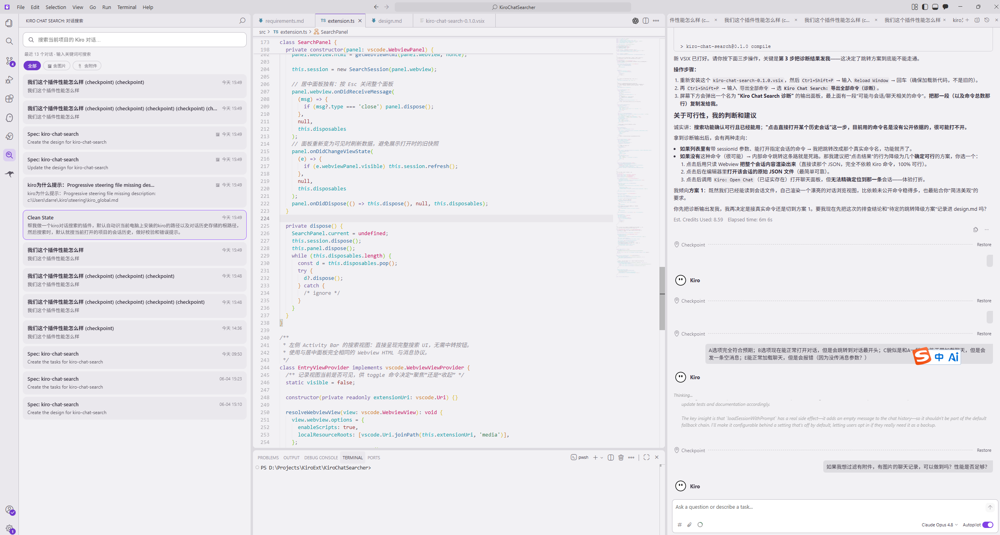

# Kiro Chat Search



在 Kiro（VSCode 衍生产品）中按关键词搜索**当前打开项目**的对话历史，点击结果直接跳转到对应会话。扩展自动识别本机 Kiro 用户数据目录与对话存储根目录，提供左侧活动栏入口与居中搜索面板，完全本地运行、零网络依赖。

## 功能概述

- 自动识别本机 Kiro 用户数据目录与对话存储根目录（Windows / macOS / Linux）
- 自动定位**当前工作区**对应的会话子目录，搜索默认只覆盖当前项目
- 左侧活动栏入口，点击即可在编辑器中央打开搜索面板
- 实时搜索（同时覆盖会话标题与消息内容），最多展示 10 条结果，按修改时间倒序
- 每条结果显示该对话的**真实 credit 消耗**（来自 Kiro 执行记录），查不到时回退展示上下文占用百分比
- 命中关键词高亮显示、上下键选择、Enter 跳转、Esc 关闭、120ms 输入防抖
- 完整的环境校验和友好的中文错误提示
- 安全：Webview 使用 `default-src 'none'` + nonce 的 CSP，所有动态内容经 HTML 转义

## 激活方式

- **活动栏入口**：左侧活动栏的 Kiro Chat Search 图标，点击后在入口面板按"🔍 打开搜索"
- **快捷键**：`Ctrl+Alt+K`（Windows / Linux）/ `Cmd+Alt+K`（macOS）打开居中搜索面板
- **折叠/展开**：`Ctrl+Alt+J`（Windows / Linux）/ `Cmd+Alt+J`（macOS）一键收起或聚焦侧边栏搜索视图，编辑代码时腾出空间
- **命令面板**：执行命令 `Kiro: 搜索对话历史`（`kiroChatSearch.openSearch`）或 `Kiro: 折叠/展开对话搜索`（`kiroChatSearch.toggleView`）

## 搜索规则

- **空关键词**：默认按修改时间倒序展示最近 **20 条**对话；每条预览取自首条用户消息（截断到 160 字符）。打开面板或清空输入时立即重新加载。
- **有关键词**：以**不区分大小写**的子串方式匹配；先匹配会话标题，标题未命中再扫描消息内容
  - 标题命中时片段为标题本身；消息命中时截取命中位置前后各约 80 字符的上下文，连续空白折叠为单个空格
  - 最多返回 **10** 条结果
- 结果按会话文件的修改时间（`mtimeMs`）**倒序**排列
- 搜索框输入有 120ms 防抖，停止输入后才触发一次请求
- 搜索框有内容时右侧显示清空（✕）按钮，点击或按 `Esc`（有内容时）即可清空并回到最近列表

## 按附件 / 图片过滤

搜索框下方有三个过滤标签：**全部** / **🖼 含图片** / **📎 含附件**。

- **含图片**：仅展示包含内嵌图片的对话（消息 content 中存在 `imageUrl` 或 `type` 含 `image` 的项）
- **含附件**：仅展示引用了文件上下文的对话（消息项的 `contextItems` 为非空数组，即 @ 进来的文件等）
- 结果项右上角会用 🖼 / 📎 角标标注该会话是否含图片 / 附件
- 切换过滤标签时会先在已加载结果上即时过滤，同时请求按当前关键词重新取数（确保过滤作用于**最新**会话数据，含面板打开后新增的对话）；切换关键词后会在新结果上沿用当前过滤条件
- 过滤后无结果时状态条提示"没有符合条件的对话"

> 图片检测只看标志字段、**不读取也不比对 base64 图片内容**，因此即便对话里嵌了大图也很快。

## 性能：会话索引缓存

为避免每次输入都把目录里所有会话重新读盘解析，扩展维护一个**进程内索引缓存**：

- 首次扫描后，每个会话只缓存匹配/展示所需的精简数据（标题、纯文本、是否含图片/附件），**内嵌的 base64 图片数据不会进入缓存或匹配范围**
- 后续搜索 / 过滤 / 最近列表只对 `mtime` 或文件大小 `size` 发生变化的文件重新解析，未变更的直接复用缓存（仍在增长的对话因 mtime 与 size 都会变化，能稳定刷新）
- 文件被删除时对应缓存条目自动清理；缓存仅存于内存，扩展停用即释放
- 缓存只影响性能，**不改变相同输入下的搜索结果**

## 对话 credit 消耗

每条搜索结果的右上角会显示该对话的用量角标：

- **`💳 70.31`**：该对话的**真实 credit 消耗**（hover 可见四位精度）。这是 Kiro 计费口径的权威值，由服务端返回，不是本地估算。
- **`◷ 24%`**：当真实 credit 不可用时的**回退**，展示会话的上下文窗口占用百分比（Kiro 本地估算，写在会话 JSON 顶层的 `contextUsagePercentage`）。
- 两者都拿不到时不显示角标。

### credit 数据从哪来

Kiro **不会**把 credit 写进对话历史 JSON——会话文件里只保留对 `executionId`（每一轮 agent 执行的 ID）的引用。真正的用量存在一份**独立的执行存档**里，由 Kiro 扩展的 `ExecutionLogController` 通过 `WriteBackCache` 落盘：

```
<UserData>/User/globalStorage/kiro.kiroagent/<workspaceId>/[<hash("KIRO::EXECUTION::SAVES")>/]<hash(executionId)>
```

- 目录名与文件名都是 **`sha256(key)` 十六进制的前 32 位**（见下方算法），与 Kiro storage 的路径哈希实现完全一致。
- 每个执行存档是一份 JSON，含 `usageSummary` 数组，credit 项形如：

  ```json
  { "usage": 0.00972499529021559, "unit": "credit", "unitPlural": "credits" }
  ```

  数组里还会混入 `{ "usedTools": [...] }` 等非 credit 项，需按 `unit === "credit"` 过滤。
- 该存档是 **LRU 缓存（上限约 500 条执行）**，较老的执行会被淘汰，因此并非所有历史对话都还查得到 credit——这也是回退到上下文百分比的原因。

### credit 计算算法

扩展按以下步骤汇总单个对话的 credit（实现见 `src/credits.ts`）：

1. **取 executionId**：解析会话 JSON 的 `history` / `messages`，收集每个条目的 `executionId`（去重）。
2. **定位执行存档**：对每个 `executionId` 计算

   ```
   fileName = sha256(executionId).toString("hex").slice(0, 32)
   ```

   在执行存储根目录下深度受限地扫描（跳过 `workspace-sessions` 与体量巨大的代码库索引子树），用 `文件名 → 绝对路径` 索引定位；未命中时强制重建一次索引重试（覆盖新产生的执行）。兼容两种布局：`<wsId>/<hash(eid)>` 与 `<wsId>/<hash(SAVES)>/<hash(eid)>`。
3. **解析用量**：用**字符串感知的括号配对**只从原文切出 `"usageSummary": [...]` 数组文本（避免整体 `JSON.parse` 多 MB 的 `operations`），再解析该数组。
4. **求和**：累加数组中所有 `unit === "credit"`（大小写不敏感）项的 `usage`，得到该执行的 credit；把会话引用的全部执行加总，即为该对话的总 credit 消耗。
5. **缓存**：单个执行存档的解析结果按 `(mtime, size)` 缓存；执行存储目录的文件名索引带 4s 节流，避免每次输入都重扫磁盘。

> 该汇总等同于把 Kiro 聊天界面里每一轮的 “Est. Credits Used” 相加。credit 只读不写，整个过程不联网。

## 跨平台路径规则

| 平台 | Kiro 用户数据目录 |
| --- | --- |
| Windows | `%APPDATA%\Kiro`（缺失时回退 `<home>\AppData\Roaming\Kiro`）|
| macOS | `~/Library/Application Support/Kiro` |
| Linux | `${XDG_CONFIG_HOME:-~/.config}/Kiro` |

会话存储根目录：

```
<UserData>/User/globalStorage/kiro.kiroagent/workspace-sessions/<base64url(workspacePath)>/<sessionId>.json
```

### WorkspacePath 编码规则

当前工作区的绝对路径被编码为目录名，规则为 `base64(utf8(workspacePath))` 后：

- 将 `+` 替换为 `-`
- 将 `/` 替换为 `_`
- 将 `=`（padding）也替换为 `_` —— 注意是**替换为 `_`，不是删除**

> 这是 Kiro 实际使用的 base64url 变体，与标准 RFC 4648 的"删除 padding"不同。
> 对于长度恰为 3 字节倍数的路径，二者结果相同（无 padding）；但当路径长度
> mod 3 ≠ 0 时（占绝大多数实际场景），错误地删除 padding 会导致 key 末尾
> 少 1～2 个 `_`，找不到磁盘上真实的会话目录。

由于不同系统在盘符大小写（`C:\` vs `c:\`）与斜杠方向（`\` vs `/`）上存在差异，扩展会为同一路径生成多种变体（盘符大小写 × 正反斜杠的组合）并分别编码、去重，依次尝试匹配实际存在的目录，从而稳健地定位会话目录。

## 跳转实现

点击或回车打开结果时，按以下优先级调用 Kiro 内部命令（兼容 Vibe / Spec 会话）：

1. **`kiroAgent.showExecutionInChatTab(sessionId)`**（主方案）—— 仅加载会话、定位到当前位置，**不发送任何消息**，无副作用。
2. `kiroAgent.viewSpecSession(sessionId)`（旧版兼容降级）—— 较老的 Kiro 版本使用，新版可能未注册。
3. `kiroAgent.loadSessionWithPrompt(sessionId, '')`（最后兜底）—— ⚠ 会向会话发送一条空消息，可能污染历史，仅在前两者全不可用时使用。

依次尝试，第一个调用成功的即生效；全部失败时弹出错误通知并列出候选命令名，便于排查。跳转成功后搜索面板不会自动关闭，方便继续浏览。

具体每个命令的实测过程与取舍见下一节。

## 会话跳转方案（研究记录）

> 这一节记录"如何按 sessionId 打开历史对话"的完整探索与实测结论，作为后续维护与版本适配的依据。

### 背景与约束

Kiro 自带的历史对话面板搜索不支持中文、也不能搜正文，这是本扩展存在的根本原因。而"点击结果跳转到对应会话"是核心需求，因此必须先确认**能否通过 sessionId 程序化打开某个历史对话**——这一点不成立，后续一切优化都没有意义。

调研中确认了两条边界：

- **官方搜索弹窗无法挂载。** 官方 "Find in Chat"（命令 `kiroAgent.chat.openSearch`）只是向 Kiro 自带的、沙箱化的 React Webview 发送一条私有协议消息 `openChatSearch`，其搜索框、搜索逻辑、结果渲染全部跑在该 Webview 内部，通过私有的 `webviewProtocol` 通道通信。第三方扩展拿不到它的 DOM、监听不到它的事件、也无法注入结果。"挂官方搜索事件动态改结果"这条路在扩展 API 层面是封死的。
- **没有公开的"查询历史会话"扩展 API。** Kiro 未对外暴露任何读取会话内容的 API，历史数据只以 JSON 文件形式存在磁盘上。因此"自己扫目录 + 解析 JSON + 自行做中文子串匹配"不是绕路，而是唯一可行的方案。

### 实测过程

跳转命令无法靠静态分析定论——`kiro.kiro-agent` 扩展 bundle 的源码里能搜到的命令，运行时不一定注册。为此在扩展中临时加了一个诊断命令，对当前工作区的真实会话逐一调用候选命令并人工确认结果。关键实测数据：

| 候选 | 命令与参数 | 实测结果 | 结论 |
| --- | --- | --- | --- |
| A | `showExecutionInChatTab(sessionId)` | 完全符合预期，正确打开且无多余消息 | ✅ **采用为主方案** |
| B | `showExecutionInChatTab(sessionId, executionId)` | 能打开，但视图被强制滚动到对话**最开头** | ❌ 不传 executionId |
| C | 先 `acpChatView.focus` 再调 A | 与 A 表现一致 | A 已自带视图激活，focus 多余 |
| D | `loadSessionWithPrompt(sessionId, '')` | 能加载会话，但**发出一条空消息**并触发响应 | ⚠ 仅兜底 |
| E | `loadSessionWithPrompt(sessionId, undefined)` | 能加载，但因缺少 prompt 参数**报错** | ❌ |

> 早期版本曾把 `kiroAgent.viewSpecSession` 当作主命令，但在当前 Kiro 版本运行时实测直接返回 `command 'kiroAgent.viewSpecSession' not found`——它走的是旧的 `sessionPanelManager`，新版改用 `acpChatView`（ACP 架构）后已不注册。保留它仅作为旧版本的降级候选。

### 关键结论

- **主方案：`kiroAgent.showExecutionInChatTab(sessionId)`，且必须省略第二个 `executionId` 参数。** 一旦传入 executionId，前端会把视图强制定位到该执行记录（通常是最早一条），导致跳到对话开头。
- `loadSessionWithPrompt` 的前端处理会**无条件**把 `prompt` 当作一条新用户消息发送（对空 prompt 没有任何保护），因此只能作为最后兜底，且需要意识到它会污染历史。
- 会话文件名 `<sessionId>.json` 与文件内部的 `obj.sessionId` 一致，可直接用文件名作为传给跳转命令的 sessionId。
- 由于跳转命令名随 Kiro 版本变化，代码中以**带优先级的候选列表**依次尝试（见 `src/jump.ts` 的 `DEFAULT_CANDIDATES`），对未来版本变更具备一定韧性。

## 错误场景与排查

| 错误提示 | 含义 | 排查方法 |
| --- | --- | --- |
| 未找到 Kiro 用户数据目录 | 未发现对应平台的 Kiro 用户数据目录 | 确认 Kiro 已安装，并存在上表中对应平台的目录 |
| 未找到 Kiro 对话存储目录 | 用户数据目录存在，但缺少 `workspace-sessions` 根目录 | 确认 Kiro 已运行过对话；检查 `User/globalStorage/kiro.kiroagent/workspace-sessions` 是否存在 |
| 当前没有打开任何工作区 | 未在 Kiro 中打开项目 | 先打开一个项目文件夹再使用搜索 |
| 当前项目还没有 Kiro 对话历史 | 当前工作区没有对应的会话子目录 | 核对面板显示的工作区路径；先在该项目中产生对话 |
| 搜索失败：&lt;原因&gt; | 搜索过程中出现未预期异常 | 查看提示中的原因；通常为文件系统权限问题 |
| 无法打开会话：未找到可用的 Kiro 跳转命令 | 三个候选跳转命令都不可用 | 确认扩展运行在 Kiro 中而非纯 VSCode；Kiro 版本变更可能导致命令名变化 |

> 单个会话文件 JSON 损坏会被静默跳过，不影响其他结果，也不会弹出错误。

## 本地开发与打包

```bash
npm install        # 安装依赖
npm run compile    # tsc 编译到 out/
npm test           # 运行 vitest 单元测试与属性测试
npx vsce package   # 打包成 .vsix
```

调试：在 VSCode / Kiro 中按 `F5` 启动扩展开发宿主。打包生成的 `.vsix` 可直接拖入 Kiro 的扩展面板安装。

## 持续集成与自动发布（GitHub Actions）

仓库内置 `.github/workflows/build.yml`，自动完成编译、测试与打包。

**版本号唯一来源**：`package.json` 的 `version` 字段。`vsce` 打包时直接读取它，无需在别处另维护版本号。

**触发规则**：

| 触发事件 | 行为 | 产物 |
| --- | --- | --- |
| push 到 `main` / 发起 PR | `npm ci` → `compile` → `test` → `vsce package` | vsix 作为 **artifact** 上传（保留 30 天，可在 Actions 运行页面下载），**不创建 Release** |
| push 形如 `v*` 的 tag（如 `v0.2.0`） | 上述全部 + 校验 tag 与 `package.json` 版本一致后创建 **GitHub Release** | Release 附带 vsix，自动生成 release notes |

> tag 版本与 `package.json` 的 `version` 不一致时 CI 会**直接报错**，强制两者同步，避免发布出版本号对不上的安装包。

**发布新版本的流程**：

```bash
# 1. 升级版本号（编辑 package.json 的 version，例如 0.2.0 -> 0.3.0）
# 2. 提交并推送
git add package.json
git commit -m "chore: 版本号升至 0.3.0"
git push origin main
# 3. 打同名 tag 并推送 —— 触发自动打包 + 创建 Release
git tag v0.3.0
git push origin v0.3.0
```

**说明**：

- Release 用 `softprops/action-gh-release` 创建，依赖 GitHub 自动注入的 `GITHUB_TOKEN`（workflow 已声明 `permissions: contents: write`），**无需手动配置任何 secret**。
- 当前仅面向本地 / GitHub 分发，未发布到 VS Code Marketplace 或 Open VSX；若需发布到市场，需额外配置对应的发布 token。
- 平时若只想拿某次提交的安装包，无需打 tag：到仓库 **Actions** 页面对应运行记录的 **Artifacts** 区下载即可。

## 项目结构

```
src/
  extension.ts        # 激活入口：命令注册、活动栏视图、居中搜索面板
  paths.ts            # PathResolver：跨平台路径解析与工作区编码
  env.ts              # EnvChecker：环境校验与错误优先级
  search.ts           # SearchEngine：会话索引缓存、关键词匹配、附件/图片标记、credit 汇总
  credits.ts          # CreditResolver：按 executionId 反查执行存档、汇总真实 credit 用量
  jump.ts             # JumpCommandResolver：跳转命令解析与回退
  webview.ts          # 搜索面板 HTML/CSS/JS 模板
  webview/format.ts   # 与 webview 共享的纯函数（escapeHtml/highlight/fmtTime/usageLabel）
  webview/filter.ts   # 与 webview 共享的附件过滤纯函数（applyAttachmentFilter）
tests/                # vitest 单元测试与 fast-check 属性测试
```

## 测试

测试基于 [vitest](https://vitest.dev/) 与 [fast-check](https://fast-check.dev/)：

- 跨平台路径解析通过可注入的 `deps`（platform / env / homedir / existsSync / statSync）测试，不污染全局 `process.platform`，也不读写真实的用户目录
- 文件相关测试使用临时目录，测试结束自动清理
- 8 条 Correctness Properties 以属性测试形式覆盖编码可逆性、路径变体覆盖、去重、命中、snippet 截取、排序限流、损坏容错与高亮包裹不变量
- credit 解析单测覆盖：哈希值与真实 Kiro 安装核对一致、`usageSummary` 数组的字符串感知切取（含字符串内 `]` 不误截断）、按 `unit` 过滤求和、扁平/SAVES 子目录两种布局定位、LRU 淘汰后的回退（credit 缺失仍带上下文百分比）
